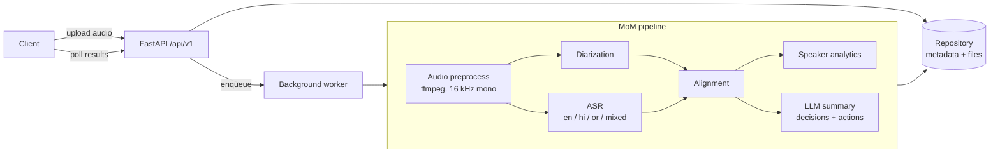

# Polymom

Voice-based **Minutes of Meeting** pipeline. Upload a meeting recording and get back:

- **Who spoke when** (multi-speaker diarization)
- **What was said** in English, Hindi, Odia and code-mixed speech (ASR)
- **Speaker analytics** such as talk time, turns and interruptions
- **An LLM summary** with key decisions and action items

Everything is exposed through a FastAPI service.

> Status: the **upload API** works: validated uploads, stored files and meeting records with status tracking. Audio processing and ML stages are still stubs. See the [roadmap](#roadmap).

## Architecture



Requests flow through the layers **routes → services / pipelines → repositories**. Routes get their dependencies (settings, repositories) injected through `app/api/deps.py`, so every layer can be swapped out in tests.

## Folder structure

| Path | Purpose |
| --- | --- |
| `app/main.py` | App factory (`create_app`), lifespan hooks, router registration |
| `app/api/deps.py` | Dependency-injection providers |
| `app/api/v1/` | Versioned routers: `health` (implemented), `meetings` (stubs) |
| `app/core/` | Settings (`pydantic-settings`), structured logging (`structlog`), exception hierarchy + handlers |
| `app/schemas/` | Pydantic request/response models |
| `app/models/` | SQLAlchemy ORM entities (`Meeting`) |
| `app/db/` | Async engine/session factory, declarative base, Alembic migrations |
| `app/repositories/` | Abstract `MeetingRepository` + SQLAlchemy implementation |
| `app/services/` | One package per pipeline stage: `audio`, `diarization`, `asr`, `alignment`, `analytics`, `summarization` |
| `app/pipelines/` | `MoMPipeline` orchestrator |
| `app/workers/` | Background job entry points |
| `app/utils/` | Framework-free helpers |
| `tests/` | `unit/` and `integration/` suites, shared fixtures in `conftest.py` |
| `docker/` | Multi-stage Dockerfile (non-root, ffmpeg) and compose file |
| `scripts/` | Dev/ops scripts |

## Setup

Prerequisites: Python 3.11+, [uv](https://docs.astral.sh/uv/), `make`, and `ffmpeg`/`ffprobe` on `PATH` (used to validate uploads; tests that need it are skipped when it is missing).

```bash
git clone https://github.com/PrayasPanda/polymom.git
cd polymom
cp .env.example .env       # fill in HF_TOKEN / LLM_API_KEY when needed
make dev                   # uv sync --all-groups + pre-commit install
```

### Configuration

| Variable | Default | Description |
| --- | --- | --- |
| `APP_ENV` | `development` | `development` / `staging` / `production` / `test`; non-development environments log JSON |
| `LOG_LEVEL` | `INFO` | Root log level |
| `HF_TOKEN` | – | Hugging Face token (for diarization models) |
| `LLM_PROVIDER` | `openai` | LLM backend for summaries |
| `LLM_API_KEY` | – | API key for the LLM provider |
| `STORAGE_DIR` | `./storage` | Uploads go to `STORAGE_DIR/uploads/{meeting_id}.{ext}` |
| `DATABASE_URL` | SQLite at `STORAGE_DIR/polymom.db` | Any SQLAlchemy async URL, e.g. `postgresql+asyncpg://...` (install `asyncpg`) |
| `AUTO_MIGRATE` | `true` | Run Alembic migrations on startup |
| `MAX_UPLOAD_MB` | `200` | Upload size limit, enforced while streaming |
| `ALLOWED_EXTENSIONS` | `wav,mp3,m4a,flac,ogg,aac,mp4,mkv,mov,webm` | Comma-separated accepted file types |
| `FFPROBE_PATH` | `ffprobe` | ffprobe binary |
| `FFPROBE_TIMEOUT_SECONDS` | `30` | Probe timeout per upload |

## Running locally

```bash
make run
curl http://localhost:8000/api/v1/health
# {"status":"ok","app_name":"polymom","version":"0.1.0","env":"development"}
```

Interactive docs: <http://localhost:8000/docs>.

### Quality gates

```bash
make lint       # ruff check + format check
make typecheck  # mypy --strict on app/
make test       # pytest with coverage
make format     # auto-fix
```

## API usage

Interactive docs with schemas and example responses: <http://localhost:8000/docs>.

| Method | Path | Description |
| --- | --- | --- |
| `GET` | `/api/v1/health` | Liveness, with app name, version and env |
| `POST` | `/api/v1/meetings` | Upload a recording (multipart). Returns `202` with `meeting_id`, `status: queued`, `created_at` |
| `GET` | `/api/v1/meetings` | Paginated list, newest first (`limit` 1-100, default 20; `offset`) |
| `GET` | `/api/v1/meetings/{meeting_id}` | Metadata and status |
| `DELETE` | `/api/v1/meetings/{meeting_id}` | Delete the record and stored file (`204`) |

```bash
# Upload (title, expected_speakers 1-20 and languages en/hi/or are optional)
curl -F "file=@standup.m4a" -F "title=Weekly sync" -F "expected_speakers=4"      -F "languages=en,hi" http://localhost:8000/api/v1/meetings
# {"meeting_id":"3f8b6f0e-...","status":"queued","created_at":"2026-09-28T10:15:00Z"}

curl http://localhost:8000/api/v1/meetings/3f8b6f0e-...
curl "http://localhost:8000/api/v1/meetings?limit=10&offset=0"
curl -X DELETE http://localhost:8000/api/v1/meetings/3f8b6f0e-...
```

### Upload validation

Each upload goes through these checks in order. If any check fails, the partially written file is deleted.

1. **Filename** is sanitized, keeping only the basename; Unicode, including Hindi and Odia, is kept.
2. **Extension** must be in `ALLOWED_EXTENSIONS`.
3. **Streamed to disk** in 1 MB chunks. The upload is rejected as soon as it exceeds `MAX_UPLOAD_MB`, and requests whose `Content-Length` is already too large are rejected before the body is read.
4. **Empty** uploads are rejected.
5. **Magic bytes** must match the extension, so a text file renamed `.wav` is rejected.
6. **ffprobe** must find a readable audio stream with a non-zero duration. The duration, codec, sample rate, channels and bit rate are recorded.

### Errors

Every error uses the same envelope:

```json
{"error": {"code": "unsupported_file_type", "message": "File content does not match its extension.", "details": {"extension": "wav", "detected_mime_type": null}}}
```

| Status | `code` | When |
| --- | --- | --- |
| 404 | `meeting_not_found` | Unknown `meeting_id` |
| 413 | `file_too_large` | Over `MAX_UPLOAD_MB` |
| 415 | `unsupported_file_type` | Extension not allowed, or content does not match it |
| 422 | `empty_file` / `corrupted_media` | Zero bytes; unreadable file; no audio stream |
| 422 | `validation_error` | Invalid form/query fields |
| 500 | `media_probe_unavailable` | `ffprobe` missing on the server |

### Database migrations

```bash
uv run alembic upgrade head                           # applied automatically at startup when AUTO_MIGRATE=true
uv run alembic revision --autogenerate -m "message"   # after changing models
```

## Running with Docker

```bash
make docker-build   # build polymom:latest
make docker-up      # docker compose up on port 8000 (reads .env if present)
```

The image uses a multi-stage build, runs as a non-root `app` user, installs `ffmpeg` and `libmagic`, and defines a `HEALTHCHECK` against `/api/v1/health`. The SQLite database and uploads live in the `storage` volume.

## Roadmap

| # | Prompt | Scope |
| --- | --- | --- |
| 1 | Project scaffold ✅ | Layout, tooling, CI, Docker, health endpoint |
| 2 | **Upload API** ✅ | Multipart upload, size/extension validation, storage, meeting records |
| 3 | Audio preprocessing | ffmpeg decode, resample, normalise, VAD |
| 4 | Speaker diarization | pyannote integration (optional `diarization` extra) |
| 5 | Multilingual ASR | Whisper-based ASR with language ID for en/hi/or and code-mixed speech |
| 6 | Alignment | Word-to-speaker attribution, speaker turns |
| 7 | Speaker analytics | Talk time, turns, interruptions, WPM |
| 8 | LLM summarization | Provider-agnostic summary, decisions and action items with structured output |
| 9 | Pipeline orchestration | End-to-end `MoMPipeline`, progress tracking, error handling |
| 10 | Background workers & persistence | Job queue, durable DB, retries |
| 11 | Results API & exports | Transcript/summary endpoints, Markdown/PDF/JSON export |
| 12 | Hardening & deployment | Auth, rate limiting, observability, GPU image, release |

## License

[MIT](LICENSE)
