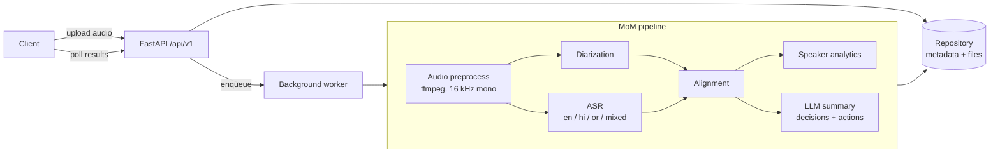
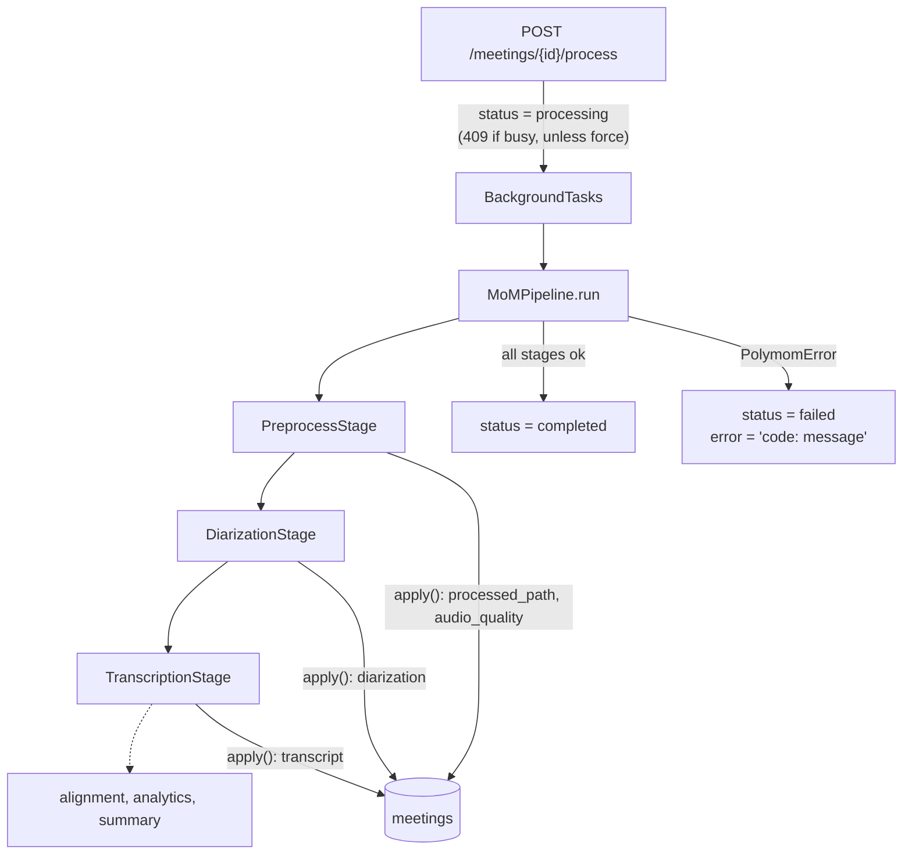
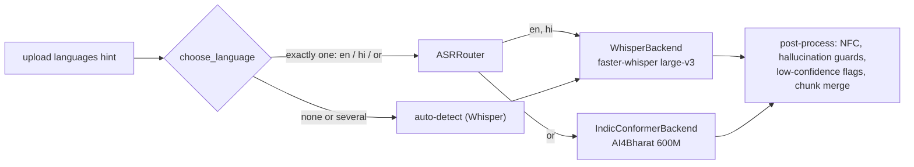

# Polymom

Voice-based **Minutes of Meeting** pipeline. Upload a meeting recording and get back:

- **Who spoke when** (multi-speaker diarization)
- **What was said** in English, Hindi, Odia and code-mixed speech (ASR)
- **Speaker analytics** such as talk time, turns and interruptions
- **An LLM summary** with key decisions and action items

Everything is exposed through a FastAPI service.

> Status: **upload**, **audio preprocessing**, **speaker diarization** and **multilingual ASR** (English, Hindi, Odia) work. Aligning words to speakers and summarization come next. See the [roadmap](#roadmap).

## Architecture



Requests flow through the layers **routes → services / pipelines → repositories**. Routes get their dependencies (settings, repositories) injected through `app/api/deps.py`, so every layer can be swapped out in tests.

## Folder structure

| Path | Purpose |
| --- | --- |
| `app/main.py` | App factory (`create_app`), lifespan hooks, router registration |
| `app/api/deps.py` | Dependency-injection providers |
| `app/api/v1/` | Versioned routers: `health` (implemented), `meetings` (stubs) |
| `app/core/` | Settings (`pydantic-settings`), structured logging (`structlog`), exception hierarchy + handlers |
| `app/schemas/` | Pydantic request/response models |
| `app/models/` | SQLAlchemy ORM entities (`Meeting`) |
| `app/db/` | Async engine/session factory, declarative base, Alembic migrations |
| `app/repositories/` | Abstract `MeetingRepository` + SQLAlchemy implementation |
| `app/services/` | One package per pipeline stage: `audio`, `diarization`, `asr`, `alignment`, `analytics`, `summarization` |
| `app/pipelines/` | `MoMPipeline` orchestrator |
| `app/workers/` | Background job entry points |
| `app/utils/` | Framework-free helpers |
| `tests/` | `unit/` and `integration/` suites, shared fixtures in `conftest.py` |
| `docker/` | Multi-stage Dockerfile (non-root, ffmpeg) and compose file |
| `scripts/` | Dev/ops scripts |

## Setup

Prerequisites: Python 3.11+, [uv](https://docs.astral.sh/uv/), `make`, and `ffmpeg`/`ffprobe` on `PATH` (used to validate uploads; tests that need it are skipped when it is missing).

```bash
git clone https://github.com/PrayasPanda/polymom.git
cd polymom
cp .env.example .env       # fill in HF_TOKEN / LLM_API_KEY when needed
make dev                   # uv sync --all-groups + pre-commit install
```

### Configuration

| Variable | Default | Description |
| --- | --- | --- |
| `APP_ENV` | `development` | `development` / `staging` / `production` / `test`; non-development environments log JSON |
| `LOG_LEVEL` | `INFO` | Root log level |
| `HF_TOKEN` | – | Hugging Face token (for diarization models) |
| `LLM_PROVIDER` | `openai` | LLM backend for summaries |
| `LLM_API_KEY` | – | API key for the LLM provider |
| `STORAGE_DIR` | `./storage` | Uploads go to `STORAGE_DIR/uploads/{meeting_id}.{ext}` |
| `DATABASE_URL` | SQLite at `STORAGE_DIR/polymom.db` | Any SQLAlchemy async URL, e.g. `postgresql+asyncpg://...` (install `asyncpg`) |
| `AUTO_MIGRATE` | `true` | Run Alembic migrations on startup |
| `MAX_UPLOAD_MB` | `200` | Upload size limit, enforced while streaming |
| `ALLOWED_EXTENSIONS` | `wav,mp3,m4a,flac,ogg,aac,mp4,mkv,mov,webm` | Comma-separated accepted file types |
| `FFPROBE_PATH` | `ffprobe` | ffprobe binary |
| `FFPROBE_TIMEOUT_SECONDS` | `30` | Probe timeout per upload |

## Running locally

```bash
make run
curl http://localhost:8000/api/v1/health
# {"status":"ok","app_name":"polymom","version":"0.1.0","env":"development"}
```

Interactive docs: <http://localhost:8000/docs>.

### Quality gates

```bash
make lint       # ruff check + format check
make typecheck  # mypy --strict on app/
make test       # fast tests with coverage (slow/real-model tests excluded)
make test-slow  # real-model tests (pyannote, Whisper, Odia); need `make install-ml`, HF_TOKEN
make format     # auto-fix
```

## API usage

Interactive docs with schemas and example responses: <http://localhost:8000/docs>.

| Method | Path | Description |
| --- | --- | --- |
| `GET` | `/api/v1/health` | Liveness, with app name, version and env |
| `POST` | `/api/v1/meetings` | Upload a recording (multipart). Returns `202` with `meeting_id`, `status: queued`, `created_at` |
| `GET` | `/api/v1/meetings` | Paginated list, newest first (`limit` 1-100, default 20; `offset`) |
| `GET` | `/api/v1/meetings/{meeting_id}` | Metadata and status |
| `DELETE` | `/api/v1/meetings/{meeting_id}` | Delete the record, the upload and the processed audio (`204`) |
| `GET` | `/api/v1/meetings/{meeting_id}/transcript` | Timestamped transcript; `?format=json` (default), `txt` or `srt`; `409` until transcribed |
| `GET` | `/api/v1/meetings/{meeting_id}/speakers` | Speaker turns (`Person 1..N`), speaker count and overlap regions; `409` until diarized |
| `POST` | `/api/v1/meetings/{meeting_id}/process` | Run the pipeline in the background (`202`); `409` if already processing/completed unless `?force=true` |

```bash
# Upload (title, expected_speakers 1-20 and languages en/hi/or are optional)
curl -F "file=@standup.m4a" -F "title=Weekly sync" -F "expected_speakers=4" \
     -F "languages=en,hi" http://localhost:8000/api/v1/meetings
# {"meeting_id":"3f8b6f0e-...","status":"queued","created_at":"2026-09-28T10:15:00Z"}

curl http://localhost:8000/api/v1/meetings/3f8b6f0e-...
curl "http://localhost:8000/api/v1/meetings?limit=10&offset=0"
curl -X DELETE http://localhost:8000/api/v1/meetings/3f8b6f0e-...

# Process, then poll until status is completed or failed
curl -X POST http://localhost:8000/api/v1/meetings/3f8b6f0e-.../process
# {"meeting_id":"3f8b6f0e-...","status":"processing"}
curl http://localhost:8000/api/v1/meetings/3f8b6f0e-...   # includes audio_quality
curl http://localhost:8000/api/v1/meetings/3f8b6f0e-.../speakers
curl "http://localhost:8000/api/v1/meetings/3f8b6f0e-.../transcript?format=srt" -o meeting.srt
```

### Upload validation

Each upload goes through these checks in order. If any check fails, the partially written file is deleted.

1. **Filename** is sanitized, keeping only the basename; Unicode, including Hindi and Odia, is kept.
2. **Extension** must be in `ALLOWED_EXTENSIONS`.
3. **Streamed to disk** in 1 MB chunks. The upload is rejected as soon as it exceeds `MAX_UPLOAD_MB`, and requests whose `Content-Length` is already too large are rejected before the body is read.
4. **Empty** uploads are rejected.
5. **Magic bytes** must match the extension, so a text file renamed `.wav` is rejected.
6. **ffprobe** must find a readable audio stream with a non-zero duration. The duration, codec, sample rate, channels and bit rate are recorded.

### Errors

Every error uses the same envelope:

```json
{"error": {"code": "unsupported_file_type", "message": "File content does not match its extension.", "details": {"extension": "wav", "detected_mime_type": null}}}
```

| Status | `code` | When |
| --- | --- | --- |
| 404 | `meeting_not_found` | Unknown `meeting_id` |
| 413 | `file_too_large` | Over `MAX_UPLOAD_MB` |
| 415 | `unsupported_file_type` | Extension not allowed, or content does not match it |
| 422 | `empty_file` / `corrupted_media` | Zero bytes; unreadable file; no audio stream |
| 422 | `validation_error` | Invalid form/query fields |
| 409 | `transcript_not_available` | `/transcript` before the meeting has been transcribed |
| 409 | `diarization_not_available` | `/speakers` before the meeting has been diarized |
| 409 | `meeting_state_conflict` | `/process` on a meeting that is processing or completed, without `force` |
| 500 | `media_probe_unavailable` | `ffprobe` missing on the server |

### Database migrations

```bash
uv run alembic upgrade head                           # applied automatically at startup when AUTO_MIGRATE=true
uv run alembic revision --autogenerate -m "message"   # after changing models
```

## Processing pipeline

### Stage pattern

`MoMPipeline` runs an ordered list of `PipelineStage`s over a shared `PipelineContext`. Each stage has a `name`, an async `run(context)` that does the work and records its outputs on the context, and an `apply(context, meeting)` that copies whatever should be persisted onto the meeting. The orchestrator owns the status lifecycle and logs each stage's timing. Adding a stage means subclassing `PipelineStage` and registering it in `build_pipeline`.



Stage failures never escape the background task. A typed error is stored as `"<code>: <message>"` (for example `ffmpeg_timeout: Audio processing timed out after 1800 seconds.`), and anything unexpected is stored as `internal_error`. A failed meeting can be reprocessed without `force`.

### Audio preprocessing

`AudioPreprocessor.process(meeting_id, input_path)` turns any validated upload into a model-ready file at `STORAGE_DIR/processed/{meeting_id}.wav`: **mono, 16 kHz, 16-bit PCM WAV**, the format Whisper and pyannote expect. The original upload is never modified.

1. **Analysis** (`analysis.py`) makes a single ffmpeg pass over the original audio. It runs `silencedetect` for silent spans, `astats` for RMS and peak level, and `ebur128` for integrated loudness in LUFS.
2. **Conversion** (`preprocessor.py`) runs this chain: first audio track (from video too), then optional `atrim` (when `TRIM_SILENCE` is on), optional `highpass` at 80 Hz, optional `afftdn` denoise, then `loudnorm` (EBU R128, −23 LUFS) and resampling. It writes to a `.part` file and atomically renames it; a failed or timed-out run deletes the partial output.
3. **Warnings** are reported but never fail processing:

| Warning | Condition |
| --- | --- |
| `low_volume` | RMS below −40 dBFS (or unmeasurable) |
| `clipping` | Peak at or above −0.1 dBFS |
| `too_short` | Shorter than 2 s |
| `mostly_silent` | More than 80 % silence |

The results are stored on the meeting as `audio_quality` and returned by `GET /meetings/{id}`:

```json
{"sample_rate": 16000, "channels": 1, "duration_seconds": 312.4, "loudness_lufs": -21.8,
 "rms_db": -24.1, "peak_db": -3.2, "silence_ratio": 0.12, "leading_silence_seconds": 1.4,
 "trailing_silence_seconds": 0.0, "trimmed_seconds": 0.0, "warnings": [], "processing_time_ms": 4180}
```

The level metrics (`loudness_lufs`, `rms_db`, `peak_db`) describe the **original** recording, so they reflect how well it was captured; after normalization every file sits at about −23 LUFS anyway.

### Chunking long recordings

`app/services/audio/chunker.py` provides `split_wav(path, out_dir, chunk_length_seconds=..., overlap_seconds=...)`. It cuts sample-accurate, overlapping WAV slices without re-encoding, and each `AudioChunk` records its absolute `start_seconds` and `end_seconds` so later stages can map timestamps back to meeting time. It isn't wired into the pipeline yet; the ASR and diarization stages will use it.

### Preprocessing configuration

| Variable | Default | Description |
| --- | --- | --- |
| `TARGET_SAMPLE_RATE` | `16000` | Output sample rate |
| `TARGET_LOUDNESS_LUFS` | `-23` | `loudnorm` integrated loudness target |
| `ENABLE_HIGHPASS` / `HIGHPASS_CUTOFF_HZ` | `true` / `80` | Remove low-frequency rumble |
| `ENABLE_DENOISE` | `false` | Light FFT denoise (`afftdn`) |
| `TRIM_SILENCE` | `false` | Cut leading/trailing silence (it is always reported) |
| `SILENCE_THRESHOLD_DB` / `SILENCE_MIN_DURATION_SECONDS` | `-50` / `0.5` | `silencedetect` sensitivity |
| `FFMPEG_PATH` / `FFMPEG_TIMEOUT_SECONDS` | `ffmpeg` / `1800` | ffmpeg binary and per-run timeout |
| `CHUNK_LENGTH_SECONDS` / `CHUNK_OVERLAP_SECONDS` | `1800` / `5` | Chunker defaults (30 min, 5 s overlap) |

## Speaker diarization

`DiarizationStage` runs after preprocessing on the 16 kHz mono WAV and answers *who spoke when*. Each speaker is labelled **Person 1, Person 2, ...**, consistently across the whole meeting. The results are stored on the meeting and served by `GET /meetings/{id}/speakers`.

### Model choice: pyannote 3.1

`pyannote/speaker-diarization-3.1` is the most widely used open diarization pipeline. It is pure PyTorch (3.0 needed `onnxruntime`), it runs acceptably on CPU and well on a GPU, and it is language-agnostic. That matters for Hindi, Odia and code-mixed meetings: it separates voices, not words. It handles overlapping speech natively, accepts `num_speakers`/`min_speakers`/`max_speakers` hints, and can return per-speaker embeddings, which we use to re-link speakers across chunks of long recordings. Its MIT license allows commercial use, though the model itself is gated behind accepting its terms.

### Hugging Face setup

1. Create a Hugging Face account and a **read** access token at <https://huggingface.co/settings/tokens>.
2. Accept the user conditions for **both** <https://huggingface.co/pyannote/speaker-diarization-3.1> and <https://huggingface.co/pyannote/segmentation-3.0> while logged in as that account.
3. Install the ML extras and configure:

   ```bash
   make install-ml            # uv sync --all-groups --extra ml (CPU torch)
   # .env
   HF_TOKEN=hf_...
   DIARIZATION_BACKEND=pyannote
   DEVICE=auto                # cuda if available, else cpu
   ```

The model downloads on first use (about 30 MB) into the Hugging Face cache (`HF_HOME`). Mistakes produce actionable errors, recorded on the meeting as `diarization_model_unavailable: ...`: a missing token, terms not accepted, missing ML extras, or `DEVICE=cuda` with no GPU.

Without a GPU or token, set `DIARIZATION_BACKEND=mock` for a deterministic fake (speakers alternate every 2 s; silent audio yields no speakers). The test suite uses the mock.

### How labels stay consistent

Post-processing (`app/services/diarization/postprocess.py`) is a set of pure functions, applied in this order:

1. **Merge gaps.** A speaker's consecutive turns are joined when the pause between them is under `MERGE_GAP_SECONDS` (0.5 s). Merging is per speaker, so a short interjection from someone else doesn't split the turn.
2. **Drop short turns.** Turns under `MIN_TURN_SECONDS` (0.3 s) are removed, except a speaker's only turn. If all of a speaker's turns are short, their longest is kept so the speaker doesn't vanish.
3. **Mark overlaps.** A sweep-line finds every span where two or more people speak. Those turns get `is_overlap: true` and the spans are listed in `overlap_regions`; overlapping speech is marked, never discarded.
4. **Relabel.** Raw model labels (`SPEAKER_00`, ...) are arbitrary, so speakers are renumbered by first appearance: whoever speaks first is Person 1. The model's label stays available as `raw_label`.

### Long recordings

Recordings longer than `DIARIZATION_CHUNK_THRESHOLD_SECONDS` (1 h) are split into `CHUNK_LENGTH_SECONDS` chunks (30 min) that overlap by `CHUNK_OVERLAP_SECONDS` (5 s), and each chunk is diarized separately. Local labels differ per chunk, so speakers are **re-linked** by the cosine similarity of their pyannote embeddings against running per-person centroids. Matching is greedy and one-to-one within a chunk; a similarity below `SPEAKER_SIMILARITY_THRESHOLD` (0.6) means a new person. This way Person 2 in chunk 1 is still Person 2 in chunk 3. Timestamps are shifted by each chunk's offset, and each chunk keeps only its half of an overlap window, so no speech is counted twice. `expected_speakers` is passed to each chunk as `max_speakers`, because a chunk may not contain everyone.

### Known limitations

- **Speed:** on a GPU, pyannote 3.1 processes an hour of audio in roughly 1.5 minutes. On CPU it is much slower, often tens of minutes per hour depending on the machine, so use a GPU for long meetings. It currently runs inside the API process; the worker queue in Prompt 11 moves it out.
- **Short or quiet speakers:** someone who only says "yes" once may be missed or merged into another speaker. `expected_speakers` helps.
- **Similar voices:** speakers with similar voices, or the same person on different microphones, can be merged or split, especially across chunks. Tune `SPEAKER_SIMILARITY_THRESHOLD`.
- **Non-speech sounds:** music and laughter can occasionally be assigned to a speaker.
- **Names:** "Person N" labels are anonymous; mapping them to real names is out of scope.

### Diarization configuration

| Variable | Default | Description |
| --- | --- | --- |
| `DIARIZATION_BACKEND` | `pyannote` | `pyannote` (real model) or `mock` |
| `DEVICE` | `auto` | `auto`, `cpu` or `cuda` |
| `HF_TOKEN` | – | Hugging Face token with the model terms accepted |
| `MERGE_GAP_SECONDS` | `0.5` | Join same-speaker turns separated by shorter pauses |
| `MIN_TURN_SECONDS` | `0.3` | Drop shorter turns (never a speaker's last trace) |
| `DIARIZATION_CHUNK_THRESHOLD_SECONDS` | `3600` | Chunk recordings longer than this |
| `SPEAKER_SIMILARITY_THRESHOLD` | `0.6` | Cosine similarity for cross-chunk re-linking |

## Speech recognition (English, Hindi, Odia)

`TranscriptionStage` runs after diarization on the 16 kHz WAV and produces a **timestamped transcript in each language's native script**: segments with word timings, confidence, language and the backend that produced them. It is independent of diarization for now; attributing words to speakers comes in a later prompt. The transcript is served by `GET /meetings/{id}/transcript` as JSON, plain text or SRT subtitles.

### Routing design

No single open model covers all three languages well, so ASR is **routed per language** to interchangeable backends (`app/services/asr/`):



- `ASRBackend` (`base.py`) defines the interface: `transcribe(audio_path, language, offset) -> ASRResult` and `supported_languages`.
- `ASRRouter` maps language codes to backends using `ASR_LANGUAGE_BACKENDS=en:whisper,hi:whisper,or:indic`. A misconfigured mapping fails at startup; an unsupported language raises `unsupported_language` with the fix in the message. Routing is a separate object so that Prompt 6 can route **per segment** after language identification.
- **Current strategy:** if exactly one language hint was given on upload, that language is forced. With no hint, or several (a code-mixed meeting), Whisper decodes without a forced language, because forcing one language on mixed speech mangles the others.
- **Long recordings** reuse the chunker (30 min chunks, 5 s overlap), and timestamps are shifted to meeting time. In each overlap, a segment belongs to the chunk that owns its midpoint. Near-duplicates that overlap in time with the previous segment (same text, contained text, or ≥ 80 % fuzzy match) are dropped, keeping the more complete version.
- `ASR_BACKEND=mock` swaps every route for a deterministic fake that emits scripted English, Hindi and Odia lines. The tests use it.

### Model choices

| Language | Model | Why |
| --- | --- | --- |
| English, Hindi | [`Systran/faster-whisper-large-v3`](https://huggingface.co/Systran/faster-whisper-large-v3) (MIT, not gated) | Whisper large-v3 is the strongest open multilingual model for English and Hindi, with language ID, native word timestamps and Silero VAD. The CTranslate2 build is up to 4× faster than the reference implementation and uses less memory, with int8 on CPU and float16 on GPU. |
| Odia | [`ai4bharat/indic-conformer-600m-multilingual`](https://huggingface.co/ai4bharat/indic-conformer-600m-multilingual) (MIT, gated, auto-approved) | **Whisper does not support Odia.** AI4Bharat's IndicConformer is purpose-built for Indian languages, and one multilingual checkpoint covers the 22 scheduled languages, including Odia. It is actively maintained and ships as ONNX with a transformers loader, so it **does not need NeMo**. |

The Odia model returns text only, with no timestamps. Segments are therefore cut at **energy-based speech regions**, accurate to one 30 ms frame, and each region is transcribed separately. **Word timings are approximated** by spreading the segment's duration over its words in proportion to their length. Segment boundaries are reliable; individual Odia word times can be off by roughly a word's length, which is fine for subtitles and speaker attribution at segment level. No confidence scores are available for Odia.

### Native scripts and normalization

Text is kept exactly in the script the model produced: Latin for English, Devanagari for Hindi, Odia script for Odia. **Nothing is ever transliterated.** All text is normalized to Unicode **NFC** so that equal-looking strings compare equal. Two notes:

- Devanagari nukta letters (क़ ज़ ड़ ...) and Odia ଡ଼/ଢ଼ are Unicode *composition exclusions*, so their NFC form is **base letter + nukta**. A model emitting precomposed `U+095B` (ज़) is normalized to `ज` + `़`.
- Odia two-part vowel signs (ୋ ୈ ୌ) are composed.

### Quality guards

- **Low confidence:** segments whose average word probability is below `ASR_LOW_CONFIDENCE_THRESHOLD` (0.5) get `low_confidence: true` and are kept.
- **Hallucinations** that Whisper produces during silence or when it loops are dropped (the counts per reason are logged):
  - empty or punctuation-only output
  - filler-only output (uh, um, hmm, हम्म ...) or known subtitle phrases ("thanks for watching") when the model reports silence (`no_speech_prob` ≥ `ASR_NO_SPEECH_THRESHOLD`) or low confidence
  - text with a compression ratio above `ASR_COMPRESSION_RATIO_THRESHOLD` (2.4), which signals repetition loops
  - a segment identical to the previous one
- Whisper also runs with `condition_on_previous_text=False` and the VAD filter enabled, which prevents most loops in the first place.

### Setup

```bash
make install-ml        # uv sync --all-groups --extra ml --extra indic
# .env
ASR_BACKEND=real
WHISPER_MODEL_SIZE=large-v3     # "small" or "medium" for CPU-only machines
HF_TOKEN=hf_...                 # accept the terms at huggingface.co/ai4bharat/indic-conformer-600m-multilingual
```

The models download on first use into `HF_HOME`: large-v3 is about 3 GB and IndicConformer is a few GB. In Docker, build with `INSTALL_ML=true INSTALL_INDIC=true`; the `model-cache` volume is shared with diarization.

### Evaluating accuracy

`scripts/eval_asr.py` transcribes a folder of recordings and reports **WER and CER per language** using jiwer. Put audio next to a same-named `.txt` reference, grouped by language folder:

```text
data/en/call1.wav  data/en/call1.txt
data/hi/clip.mp3   data/hi/clip.txt
data/or/demo.wav   data/or/demo.txt
```

```bash
make eval-asr DATA=data/                                  # real models
uv run python scripts/eval_asr.py data/ --json report.json
uv run python scripts/eval_asr.py data/ --backend mock    # plumbing check only
```

Before scoring, both texts are NFC-normalized, case-folded and stripped of punctuation, including the danda (।). **CER is the metric to watch for Hindi and Odia**, where word segmentation and spelling variants inflate WER.

### Known limitations

- **Odia timestamps** are approximate at word level (see above), and Odia segments carry no confidence.
- **Code-mixed speech:** without a single-language hint, Whisper picks one language per 30 s window. Hindi-English mixing is usually transcribed reasonably, but Odia inside a mixed meeting is sent to Whisper, which cannot transcribe it well. Per-segment language ID and routing is Prompt 6. Whisper also sometimes labels Hindi as Urdu and writes it in Perso-Arabic script; pass `languages=hi` when you know the language.
- **Compute:** faster-whisper large-v3 needs roughly 5 GB of GPU memory in float16. On CPU (int8) it runs at roughly real time or slower, so use `small` or `medium` on CPU-only hosts. Both models load inside the API process until the worker queue arrives.
- **Model downloads:** the first transcription of each language downloads the model, so it is slow.

### ASR configuration

| Variable | Default | Description |
| --- | --- | --- |
| `ASR_BACKEND` | `real` | `real` or `mock` |
| `WHISPER_MODEL_SIZE` | `large-v3` | Any faster-whisper size/model id |
| `WHISPER_COMPUTE_TYPE` | `auto` | `auto` = float16 on GPU, int8 on CPU |
| `ODIA_MODEL_ID` / `ODIA_DECODING` | IndicConformer 600M / `rnnt` | Odia model and decoder (`rnnt` more accurate, `ctc` faster) |
| `ASR_LANGUAGE_BACKENDS` | `en:whisper,hi:whisper,or:indic` | Language → backend routing |
| `ASR_BEAM_SIZE` | `5` | Whisper beam size |
| `ASR_VAD_FILTER` | `true` | Whisper Silero VAD |
| `ASR_LOW_CONFIDENCE_THRESHOLD` | `0.5` | Flag segments below this average confidence |
| `ASR_COMPRESSION_RATIO_THRESHOLD` / `ASR_NO_SPEECH_THRESHOLD` | `2.4` / `0.6` | Hallucination guards |

## Running with Docker

```bash
make docker-build   # build polymom:latest
make docker-up      # docker compose up on port 8000 (reads .env if present)
```

```bash
make docker-build-ml                                   # torch (CPU), pyannote, faster-whisper, Odia ASR
docker build -f docker/Dockerfile --build-arg INSTALL_ML=true \
    --build-arg TORCH_VARIANT=cu124 -t polymom:cuda .   # CUDA torch; run with --gpus all
INSTALL_ML=true docker compose -f docker/docker-compose.yml up --build
```

By default the image stays light, without ML. `INSTALL_ML=true` adds torch, pyannote and faster-whisper, and `INSTALL_INDIC=true` adds the Odia ASR runtime; `TORCH_VARIANT` swaps in CUDA wheels of the same torch version. Downloaded models are cached in the `model-cache` volume (`HF_HOME=/app/.cache/huggingface`), so they survive restarts.

The image uses a multi-stage build, runs as a non-root `app` user, installs `ffmpeg` and `libmagic`, and defines a `HEALTHCHECK` against `/api/v1/health`. The SQLite database and uploads live in the `storage` volume.

## Roadmap

| # | Prompt | Scope |
| --- | --- | --- |
| 1 | Project scaffold ✅ | Layout, tooling, CI, Docker, health endpoint |
| 2 | Upload API ✅ | Multipart upload, size/extension validation, storage, meeting records |
| 3 | Audio preprocessing ✅ | ffmpeg extract, resample, loudness-normalize, silence/quality analysis, chunking, stage-based pipeline |
| 4 | Speaker diarization ✅ | pyannote 3.1 stage, consistent Person N labels, overlaps, chunk re-linking |
| 5 | **Multilingual ASR** ✅ | Routed ASR: faster-whisper (en/hi) + AI4Bharat IndicConformer (or), NFC native script, hallucination guards, SRT, WER/CER eval |
| 6 | Alignment | Word-to-speaker attribution, speaker turns |
| 7 | Speaker analytics | Talk time, turns, interruptions, WPM |
| 8 | LLM summarization | Provider-agnostic summary, decisions and action items with structured output |
| 9 | Pipeline orchestration | End-to-end `MoMPipeline`, progress tracking, error handling |
| 10 | Background workers & persistence | Job queue, durable DB, retries |
| 11 | Results API & exports | Transcript/summary endpoints, Markdown/PDF/JSON export |
| 12 | Hardening & deployment | Auth, rate limiting, observability, GPU image, release |

## License

[MIT](LICENSE)
