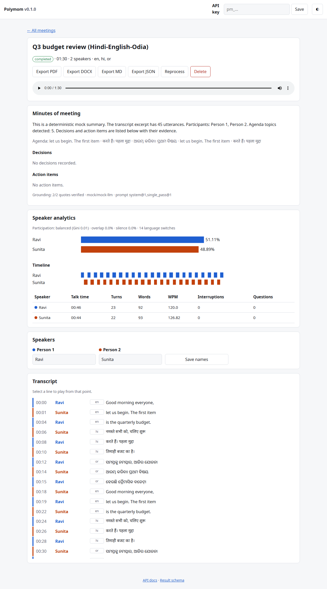
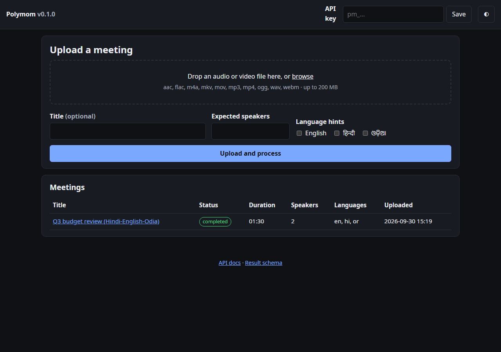
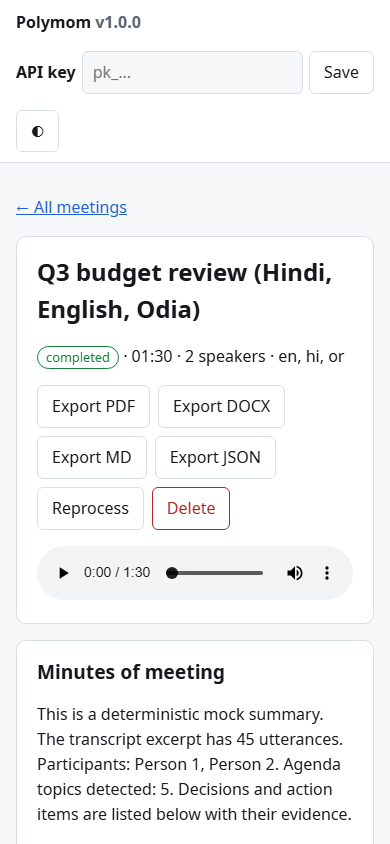
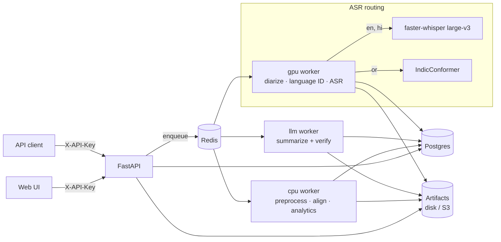

# Polymom

[](https://github.com/PrayasPanda/polymom/actions/workflows/ci.yml)
[](https://github.com/PrayasPanda/polymom/actions/workflows/e2e.yml)
[](https://codecov.io/gh/PrayasPanda/polymom)
[](LICENSE)
[](pyproject.toml)

**Multilingual minutes of meeting from a recording.** Polymom takes an audio or video
recording of a meeting held in English, Hindi, Odia or any mix of them. It works out who
spoke when, identifies the spoken language region by region and sends each region to the
best speech model for that language. It then attributes every word to a speaker and
produces grounded minutes: a summary, decisions and action items, each backed by a
verbatim quote from the transcript. All of it is available through a REST API and a
lightweight web UI, runs on your own GPU or CPU, and ships as Docker images.



*Screenshots from `make demo` (mock ML backends, scripted en/hi/or dialogue). Exports with a real LLM summary: [docs/samples](docs/samples/).*

| Upload and meetings (dark mode) | Mobile |
| --- | --- |
|  |  |

## Quickstart

Needs Docker (and `make`; on Windows, use WSL or run the two commands behind `make demo`).

```bash
git clone https://github.com/PrayasPanda/polymom.git && cd polymom
make demo        # builds, starts API + workers + Postgres + Redis, creates an API key,
                 # processes a sample meeting and prints the UI URL and key
# open http://localhost:8000, paste the printed pk_... key at the top
make demo-down
```

The demo uses mock ML backends, so it runs anywhere in a few minutes. For real models on
an NVIDIA GPU, accept the terms of the three gated models listed in
[OPERATIONS.md](docs/OPERATIONS.md#running-with-a-gpu), put `HF_TOKEN` in `.env`, and run
`docker compose -f docker/docker-compose.yml --profile gpu up -d --build --scale worker-gpu=0`.

Without Docker: `make dev && make run`, then `PIPELINE_EXECUTION=inline` for a single
process (see [CONTRIBUTING.md](CONTRIBUTING.md)). `pip install .` installs the API alone;
without the `ml` extra it starts with a warning and can use only mock or remote backends.

## Assignment requirements

| # | Requirement | Status | Where |
| --- | --- | --- | --- |
| 1 | Accept meeting recordings (audio and video) | ✅ | `POST /meetings`: wav, mp3, m4a, flac, ogg, aac, mp4, mkv, mov, webm; streamed, validated ([API](docs/API.md#upload-validation)) |
| 2 | Audio preprocessing | ✅ | `app/services/audio/`: 16 kHz mono, loudness normalisation, high-pass, optional denoise and trim, quality warnings |
| 3 | Speaker diarization (who spoke when) | ✅ | `app/services/diarization/`: pyannote 3.1, `Person 1..N`, chunk re-linking for long meetings |
| 4 | Overlapping speech and speaker-count hints | ✅ | Overlap regions and `has_overlap` per utterance; `expected_speakers` on upload |
| 5 | English transcription | ✅ | faster-whisper large-v3 (`app/services/asr/whisper_backend.py`) |
| 6 | Hindi transcription (Devanagari) | ✅ | faster-whisper large-v3, native script, NFC |
| 7 | Odia transcription (Odia script) | ✅ | AI4Bharat IndicConformer (`app/services/asr/indic_backend.py`); Whisper has no Odia |
| 8 | Code-mixed / code-switched speech | ✅ | Per-region language routing, word-level code-mix tags ([MULTILINGUAL](docs/MULTILINGUAL.md)) |
| 9 | Language identification | ✅ | MMS-LID-126 on turn windows, smoothing, `/languages` with switch points |
| 10 | Timestamped, speaker-attributed transcript | ✅ | `app/services/alignment/`; json, txt, srt, vtt, md |
| 11 | Speaker naming | ✅ | `PATCH /meetings/{id}/speakers`, applied in every format and in the UI |
| 12 | Speaker-wise conversation statistics | ✅ | `app/services/analytics/`: talk time, turns, interruptions, WPM, questions, languages, balance, timeline |
| 13 | Meeting summary (minutes of meeting) | ✅ | `app/services/summarization/`: executive summary, agenda, key points, open questions |
| 14 | Key decisions | ✅ | Decisions with maker, rationale, confidence, supersession, evidence |
| 15 | Action items (owner, due date) | ✅ | Owner (never guessed), due date (raw and ISO), priority, evidence |
| 16 | API or simple interface | ✅ | REST API ([API.md](docs/API.md), [openapi.json](docs/openapi.json)) and web UI at `/` (`app/ui/`) |
| 17 | Structured output and exports | ✅ | `MeetingResult` JSON with a published JSON Schema; PDF, DOCX, Markdown and JSON exports with Indic fonts |
| 18 | Documentation: technology choices, multilingual approach, evaluation | ✅ | [TECHNOLOGY_CHOICES](docs/TECHNOLOGY_CHOICES.md), [MULTILINGUAL](docs/MULTILINGUAL.md), [evaluation](docs/evaluation/results.md) |

Beyond the core: job queue with resumable, checkpointed runs, cancel and SSE progress;
signed webhooks; API keys with tenant isolation; rate limits; full-text search in any
script; retention; Prometheus, OpenTelemetry and Grafana; CPU and CUDA images.

## Architecture



Stages: **preprocess → diarize → identify languages → transcribe (routed per language
region) → align words to speakers → analytics → summarize**. Each stage is checkpointed,
so a crash, deploy or retry resumes where it stopped. Details are in
[ARCHITECTURE.md](docs/ARCHITECTURE.md) and the stage-by-stage
[PIPELINE.md](docs/PIPELINE.md).

## Sample output

A code-mixed standup (Hinglish and Odia) as
[result JSON](docs/samples/code-mixed-meeting.result.json),
[Markdown minutes](docs/samples/code-mixed-meeting.md),
[PDF](docs/samples/code-mixed-meeting.pdf) and [DOCX](docs/samples/code-mixed-meeting.docx).
The transcript is a hand-written fixture. The analytics, minutes and exports were produced
by the real code with a local LLM (`ollama/qwen2.5:7b-instruct`) and are committed
unedited, including what the small model missed (see
[MULTILINGUAL.md](docs/MULTILINGUAL.md#observed-limitations)). An excerpt of the result
JSON:

```json
{
  "transcript": {"utterances": [
    {"id": 1, "speaker": "Person 2", "start": 5.5, "end": 11.0,
     "text": "Payment API का timeout issue अभी भी है, logs देख रहा हूं।", "primary_language": "hi"},
    {"id": 4, "speaker": "Person 3", "start": 21.5, "end": 27.0,
     "text": "ମୁଁ agle hafte load testing କରିବି।", "primary_language": "or"}
  ]},
  "summary": {"action_items": [
    {"task": "Fix Payment API timeout issue and update the ticket.", "owner": "Person 2",
     "due_date": {"raw": "kal", "iso": null}, "priority": "high", "confidence": "high",
     "evidence": [{"utterance_ids": [3], "speaker": "Person 2", "start": 16.5, "end": 21.0,
                   "quote": "Main kal tak fix deploy kar dunga, I will update the ticket."}]}
  ]}
}
```

## Evaluation

Real models on public data. Everything is downloaded at runtime by
`scripts/prepare_eval_data.py` and nothing is committed. The full table, hardware, model
versions and per-meeting numbers are in
[docs/evaluation/results.md](docs/evaluation/results.md), and the method is in
[docs/evaluation/README.md](docs/evaluation/README.md).

Measured on 2026-10-01 on an RTX 5060 Laptop GPU (8 GB) with faster-whisper large-v3
(`int8_float16`), MMS-LID-126 and, for summaries, a local `qwen2.5:7b-instruct`:

| Metric | Result | Data |
| --- | --- | --- |
| English WER / CER | **5.2% / 2.3%** | FLEURS test, 30 clips |
| Hindi WER / CER | **31.0% / 14.6%** | FLEURS test, 30 clips |
| Code-mixed Hindi-English CER (no language hint) | **38.5%** | MUCS 2021 test, 48 clips |
| Spoken language ID accuracy (English and Hindi clips) | **100%** | FLEURS, 60 clips |
| Language ID on code-mixed speech | **96.8%** | MUCS 2021, 48 clips |
| Action items precision / recall | **100% / 57%** | 4 labelled meetings (en, hi, or, mixed) |
| Decisions precision / recall | **100% / 20%** | 4 labelled meetings |
| Evidence grounding rate | **74%** | 4 labelled meetings |
| Real-time factor, ASR + language ID | **0.65** | 24.8 min of short clips, model loading included |
| Odia WER / CER | *pending* | FLEURS `or_in` is downloaded; the model is gated |
| DER, speaker-count accuracy, speaker-attributed WER, meeting CER | *pending* | 8 synthetic code-mixed meetings and 2 AMI meetings are prepared |

The pending rows need the gated Hugging Face models (pyannote diarization and
IndicConformer for Odia), and no `HF_TOKEN` was available when this was run. They are
reported as pending rather than estimated. With a token, `make benchmark-docker` fills
them in.

How to read these numbers:

- The Hindi and code-mixed error rates are inflated by script and spelling differences
  that aren't recognition errors, for example `university` against `यूनिवर्सिटी` or
  `linux` against `लिनक्स`. [MULTILINGUAL.md](docs/MULTILINGUAL.md#observed-limitations)
  has the examples.
- Summary precision is high because unverifiable items are dropped. Recall is limited by
  the 7B local model; a larger model is one setting away (`LLM_PROVIDER`, `LLM_MODEL`).

## Documentation

| Document | Contents |
| --- | --- |
| [ARCHITECTURE.md](docs/ARCHITECTURE.md) | Components, stages, data flow, design patterns and why |
| [TECHNOLOGY_CHOICES.md](docs/TECHNOLOGY_CHOICES.md) | Choice, alternatives and rationale per area |
| [MULTILINGUAL.md](docs/MULTILINGUAL.md) | Models per language, code-switching, testing, limitations, improvements |
| [API.md](docs/API.md) | Endpoint reference with curl examples; [openapi.json](docs/openapi.json) |
| [OPERATIONS.md](docs/OPERATIONS.md) | Every env var, GPU, scaling, monitoring, retention, troubleshooting |
| [PIPELINE.md](docs/PIPELINE.md) | Stage-by-stage behaviour, configuration and known limitations |
| [SECURITY.md](docs/SECURITY.md) | Threat model, controls, accepted risks, branch protection |
| [evaluation/](docs/evaluation/) | Benchmark method and results |
| [CONTRIBUTING.md](CONTRIBUTING.md) · [CHANGELOG.md](CHANGELOG.md) · [CODE_OF_CONDUCT.md](CODE_OF_CONDUCT.md) | Development workflow, release history |

## Development

```bash
make dev            # dependencies + pre-commit
make lint typecheck test          # ruff, mypy --strict, pytest with coverage (≥ 85% in CI)
make e2e-up e2e e2e-down          # end-to-end suite against docker compose (mock backends)
make eval-data eval-meetings benchmark   # evaluation (real models: make install-ml, HF_TOKEN)
```

## Roadmap

- Migrate to pyannote.audio 4 and transformers 5, which clears the accepted transformers
  advisories.
- A commercially licensed Odia-capable language ID model, to replace CC-BY-NC MMS-LID.
- Odia word timestamps via CTC forced alignment, for word-precise attribution.
- A larger code-mixed test set with real multi-party meetings, especially Odia-English.
- Streaming or near-real-time transcription for live meetings.
- Speaker identification across meetings (enrolled voices) as an opt-in feature.
- SSO/OIDC for the UI and per-user keys.

## License

[MIT](LICENSE). Model weights keep their own licenses. Notably, MMS-LID is
CC-BY-NC-4.0; see [TECHNOLOGY_CHOICES.md](docs/TECHNOLOGY_CHOICES.md#spoken-language-identification).
