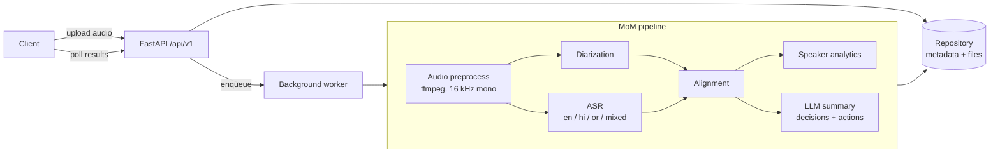
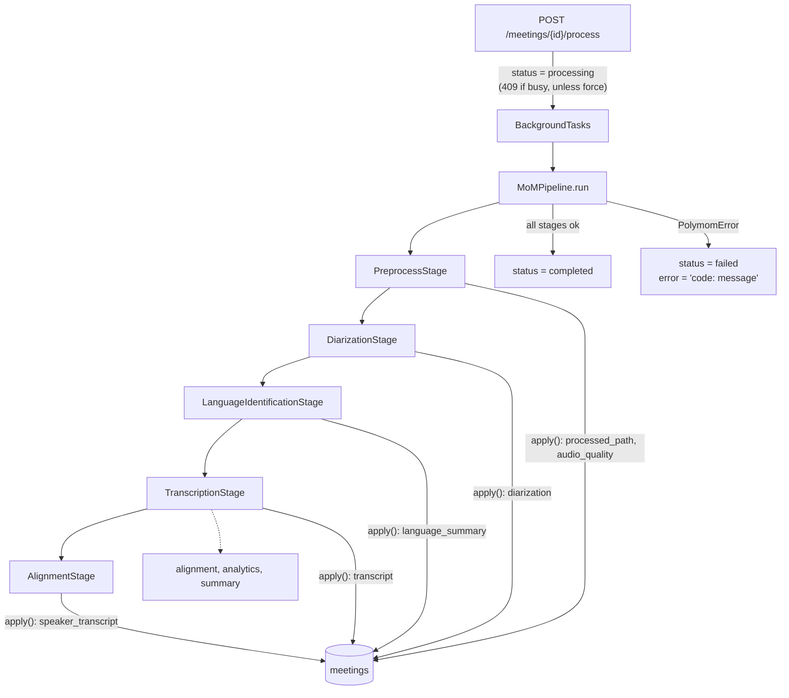
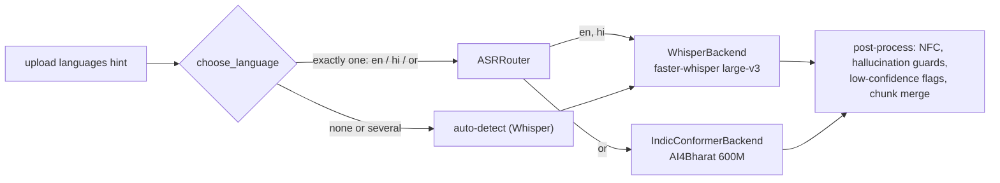
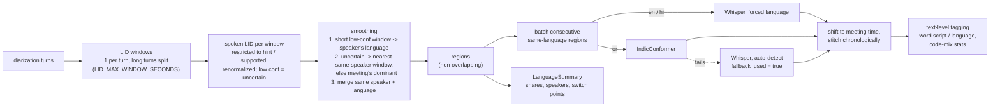
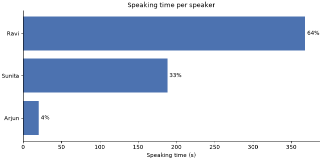
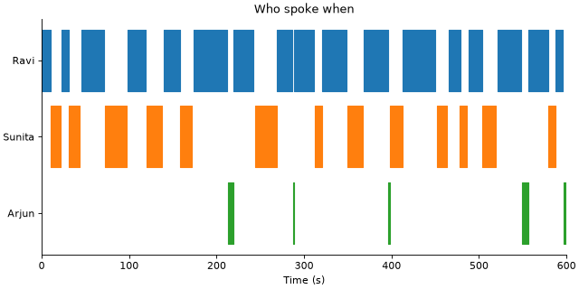
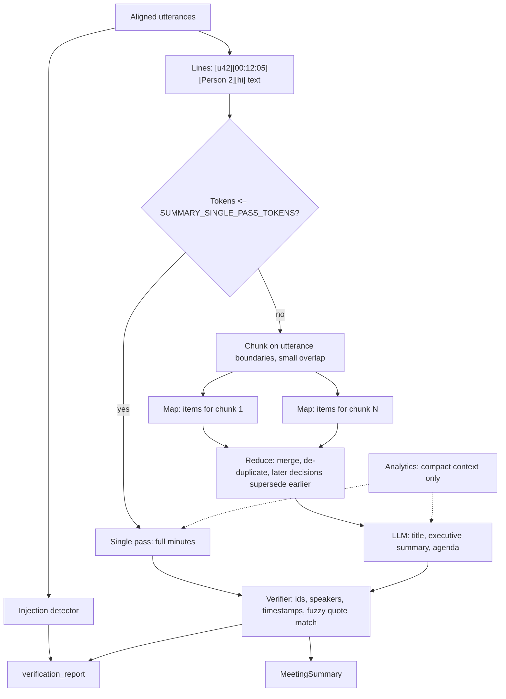

# Polymom

Voice-based **Minutes of Meeting** pipeline. Upload a meeting recording and get back:

- **Who spoke when** (multi-speaker diarization)
- **What was said** in English, Hindi, Odia and code-mixed speech (ASR)
- **Speaker analytics** such as talk time, turns and interruptions
- **An LLM summary** with key decisions and action items

Everything is exposed through a FastAPI service.

> Status: the pipeline produces a **speaker-attributed, multilingual transcript** (English, Hindi, Odia, code-switched): upload, preprocessing, diarization, language ID, routed ASR and word-to-speaker alignment all work. Speaker statistics and summaries come next. See the [roadmap](#roadmap).

## Architecture



Requests flow through the layers **routes → services / pipelines → repositories**. Routes get their dependencies (settings, repositories) injected through `app/api/deps.py`, so every layer can be swapped out in tests.

## Folder structure

| Path | Purpose |
| --- | --- |
| `app/main.py` | App factory (`create_app`), lifespan hooks, router registration |
| `app/api/deps.py` | Dependency-injection providers |
| `app/api/v1/` | Versioned routers: `health` (implemented), `meetings` (stubs) |
| `app/core/` | Settings (`pydantic-settings`), structured logging (`structlog`), exception hierarchy + handlers |
| `app/schemas/` | Pydantic request/response models |
| `app/models/` | SQLAlchemy ORM entities (`Meeting`) |
| `app/db/` | Async engine/session factory, declarative base, Alembic migrations |
| `app/repositories/` | Abstract `MeetingRepository` + SQLAlchemy implementation |
| `app/services/` | One package per pipeline stage: `audio`, `diarization`, `asr`, `alignment`, `analytics`, `summarization` |
| `app/pipelines/` | `MoMPipeline` orchestrator |
| `app/workers/` | Background job entry points |
| `app/utils/` | Framework-free helpers |
| `tests/` | `unit/` and `integration/` suites, shared fixtures in `conftest.py` |
| `docker/` | Multi-stage Dockerfile (non-root, ffmpeg) and compose file |
| `scripts/` | Dev/ops scripts |

## Setup

Prerequisites: Python 3.11+, [uv](https://docs.astral.sh/uv/), `make`, and `ffmpeg`/`ffprobe` on `PATH` (used to validate uploads; tests that need it are skipped when it is missing).

```bash
git clone https://github.com/PrayasPanda/polymom.git
cd polymom
cp .env.example .env       # fill in HF_TOKEN / LLM_API_KEY when needed
make dev                   # uv sync --all-groups + pre-commit install
```

### Configuration

| Variable | Default | Description |
| --- | --- | --- |
| `APP_ENV` | `development` | `development` / `staging` / `production` / `test`; non-development environments log JSON |
| `LOG_LEVEL` | `INFO` | Root log level |
| `HF_TOKEN` | – | Hugging Face token (for diarization models) |
| `LLM_PROVIDER` | `openai` | LLM backend for summaries: `openai`, `azure`, `anthropic`, `ollama`, `mock` |
| `LLM_API_KEY` | – | API key for the LLM provider |
| `STORAGE_DIR` | `./storage` | Uploads go to `STORAGE_DIR/uploads/{meeting_id}.{ext}` |
| `DATABASE_URL` | SQLite at `STORAGE_DIR/polymom.db` | Any SQLAlchemy async URL, e.g. `postgresql+asyncpg://...` (install `asyncpg`) |
| `AUTO_MIGRATE` | `true` | Run Alembic migrations on startup |
| `MAX_UPLOAD_MB` | `200` | Upload size limit, enforced while streaming |
| `ALLOWED_EXTENSIONS` | `wav,mp3,m4a,flac,ogg,aac,mp4,mkv,mov,webm` | Comma-separated accepted file types |
| `FFPROBE_PATH` | `ffprobe` | ffprobe binary |
| `FFPROBE_TIMEOUT_SECONDS` | `30` | Probe timeout per upload |

## Running locally

```bash
make run
curl http://localhost:8000/api/v1/health
# {"status":"ok","app_name":"polymom","version":"0.1.0","env":"development"}
```

Interactive docs: <http://localhost:8000/docs>.

### Quality gates

```bash
make lint       # ruff check + format check
make typecheck  # mypy --strict on app/
make test       # fast tests with coverage (slow/real-model tests excluded)
make test-slow  # real-model tests (pyannote, Whisper, Odia); need `make install-ml`, HF_TOKEN
make format     # auto-fix
```

## API usage

Interactive docs with schemas and example responses: <http://localhost:8000/docs>.

| Method | Path | Description |
| --- | --- | --- |
| `GET` | `/api/v1/health` | Liveness, with app name, version and env |
| `POST` | `/api/v1/meetings` | Upload a recording (multipart). Returns `202` with `meeting_id`, `status: queued`, `created_at` |
| `GET` | `/api/v1/meetings` | Paginated list, newest first (`limit` 1-100, default 20; `offset`) |
| `GET` | `/api/v1/meetings/{meeting_id}` | Metadata and status |
| `DELETE` | `/api/v1/meetings/{meeting_id}` | Delete the record, the upload and the processed audio (`204`) |
| `GET` | `/api/v1/meetings/{meeting_id}/languages` | Language shares, per-speaker breakdown, switch points; `409` until identified |
| `GET` | `/api/v1/meetings/{meeting_id}/transcript` | Speaker-attributed transcript; `?format=json` (default), `txt`, `srt`, `vtt`, `md`; raw ASR segments with `?view=raw` (`json`, `txt`, `srt`); `409` until processed |
| `PATCH` | `/api/v1/meetings/{meeting_id}/speakers` | Display names, e.g. `{"names": {"Person 1": "Ravi"}}` (`null` clears one) |
| `GET` | `/api/v1/meetings/{meeting_id}/speakers` | Speaker turns (`Person 1..N`), speaker count and overlap regions; `409` until diarized |
| `POST` | `/api/v1/meetings/{meeting_id}/process` | Run the pipeline in the background (`202`); `409` if already processing/completed unless `?force=true` |

```bash
# Upload (title, expected_speakers 1-20 and languages en/hi/or are optional)
curl -F "file=@standup.m4a" -F "title=Weekly sync" -F "expected_speakers=4" \
     -F "languages=en,hi" http://localhost:8000/api/v1/meetings
# {"meeting_id":"3f8b6f0e-...","status":"queued","created_at":"2026-09-28T10:15:00Z"}

curl http://localhost:8000/api/v1/meetings/3f8b6f0e-...
curl "http://localhost:8000/api/v1/meetings?limit=10&offset=0"
curl -X DELETE http://localhost:8000/api/v1/meetings/3f8b6f0e-...

# Process, then poll until status is completed or failed
curl -X POST http://localhost:8000/api/v1/meetings/3f8b6f0e-.../process
# {"meeting_id":"3f8b6f0e-...","status":"processing"}
curl http://localhost:8000/api/v1/meetings/3f8b6f0e-...   # includes audio_quality
curl http://localhost:8000/api/v1/meetings/3f8b6f0e-.../speakers
curl "http://localhost:8000/api/v1/meetings/3f8b6f0e-.../transcript?format=srt" -o meeting.srt
curl -X PATCH http://localhost:8000/api/v1/meetings/3f8b6f0e-.../speakers \
     -H 'Content-Type: application/json' -d '{"names": {"Person 1": "Ravi"}}'
```

### Upload validation

Each upload goes through these checks in order. If any check fails, the partially written file is deleted.

1. **Filename** is sanitized, keeping only the basename; Unicode, including Hindi and Odia, is kept.
2. **Extension** must be in `ALLOWED_EXTENSIONS`.
3. **Streamed to disk** in 1 MB chunks. The upload is rejected as soon as it exceeds `MAX_UPLOAD_MB`, and requests whose `Content-Length` is already too large are rejected before the body is read.
4. **Empty** uploads are rejected.
5. **Magic bytes** must match the extension, so a text file renamed `.wav` is rejected.
6. **ffprobe** must find a readable audio stream with a non-zero duration. The duration, codec, sample rate, channels and bit rate are recorded.

### Errors

Every error uses the same envelope:

```json
{"error": {"code": "unsupported_file_type", "message": "File content does not match its extension.", "details": {"extension": "wav", "detected_mime_type": null}}}
```

| Status | `code` | When |
| --- | --- | --- |
| 404 | `meeting_not_found` | Unknown `meeting_id` |
| 413 | `file_too_large` | Over `MAX_UPLOAD_MB` |
| 415 | `unsupported_file_type` | Extension not allowed, or content does not match it |
| 422 | `empty_file` / `corrupted_media` | Zero bytes; unreadable file; no audio stream |
| 422 | `validation_error` | Invalid form/query fields |
| 409 | `language_summary_not_available` | `/languages` before language ID ran (or with routing disabled) |
| 409 | `transcript_not_available` | `/transcript` before the meeting has been transcribed |
| 409 | `diarization_not_available` | `/speakers` before the meeting has been diarized |
| 409 | `meeting_state_conflict` | `/process` on a meeting that is processing or completed, without `force` |
| 500 | `media_probe_unavailable` | `ffprobe` missing on the server |

### Database migrations

```bash
uv run alembic upgrade head                           # applied automatically at startup when AUTO_MIGRATE=true
uv run alembic revision --autogenerate -m "message"   # after changing models
```

## Processing pipeline

### Stage pattern

`MoMPipeline` runs an ordered list of `PipelineStage`s over a shared `PipelineContext`. Each stage has a `name`, an async `run(context)` that does the work and records its outputs on the context, and an `apply(context, meeting)` that copies whatever should be persisted onto the meeting. The orchestrator owns the status lifecycle and logs each stage's timing. Adding a stage means subclassing `PipelineStage` and registering it in `build_pipeline`.



Stage failures never escape the background task. A typed error is stored as `"<code>: <message>"` (for example `ffmpeg_timeout: Audio processing timed out after 1800 seconds.`), and anything unexpected is stored as `internal_error`. A failed meeting can be reprocessed without `force`.

### Audio preprocessing

`AudioPreprocessor.process(meeting_id, input_path)` turns any validated upload into a model-ready file at `STORAGE_DIR/processed/{meeting_id}.wav`: **mono, 16 kHz, 16-bit PCM WAV**, the format Whisper and pyannote expect. The original upload is never modified.

1. **Analysis** (`analysis.py`) makes a single ffmpeg pass over the original audio. It runs `silencedetect` for silent spans, `astats` for RMS and peak level, and `ebur128` for integrated loudness in LUFS.
2. **Conversion** (`preprocessor.py`) runs this chain: first audio track (from video too), then optional `atrim` (when `TRIM_SILENCE` is on), optional `highpass` at 80 Hz, optional `afftdn` denoise, then `loudnorm` (EBU R128, −23 LUFS) and resampling. It writes to a `.part` file and atomically renames it; a failed or timed-out run deletes the partial output.
3. **Warnings** are reported but never fail processing:

| Warning | Condition |
| --- | --- |
| `low_volume` | RMS below −40 dBFS (or unmeasurable) |
| `clipping` | Peak at or above −0.1 dBFS |
| `too_short` | Shorter than 2 s |
| `mostly_silent` | More than 80 % silence |

The results are stored on the meeting as `audio_quality` and returned by `GET /meetings/{id}`:

```json
{"sample_rate": 16000, "channels": 1, "duration_seconds": 312.4, "loudness_lufs": -21.8,
 "rms_db": -24.1, "peak_db": -3.2, "silence_ratio": 0.12, "leading_silence_seconds": 1.4,
 "trailing_silence_seconds": 0.0, "trimmed_seconds": 0.0, "warnings": [], "processing_time_ms": 4180}
```

The level metrics (`loudness_lufs`, `rms_db`, `peak_db`) describe the **original** recording, so they reflect how well it was captured; after normalization every file sits at about −23 LUFS anyway.

### Chunking long recordings

`app/services/audio/chunker.py` provides `split_wav(path, out_dir, chunk_length_seconds=..., overlap_seconds=...)`. It cuts sample-accurate, overlapping WAV slices without re-encoding, and each `AudioChunk` records its absolute `start_seconds` and `end_seconds` so later stages can map timestamps back to meeting time. It isn't wired into the pipeline yet; the ASR and diarization stages will use it.

### Preprocessing configuration

| Variable | Default | Description |
| --- | --- | --- |
| `TARGET_SAMPLE_RATE` | `16000` | Output sample rate |
| `TARGET_LOUDNESS_LUFS` | `-23` | `loudnorm` integrated loudness target |
| `ENABLE_HIGHPASS` / `HIGHPASS_CUTOFF_HZ` | `true` / `80` | Remove low-frequency rumble |
| `ENABLE_DENOISE` | `false` | Light FFT denoise (`afftdn`) |
| `TRIM_SILENCE` | `false` | Cut leading/trailing silence (it is always reported) |
| `SILENCE_THRESHOLD_DB` / `SILENCE_MIN_DURATION_SECONDS` | `-50` / `0.5` | `silencedetect` sensitivity |
| `FFMPEG_PATH` / `FFMPEG_TIMEOUT_SECONDS` | `ffmpeg` / `1800` | ffmpeg binary and per-run timeout |
| `CHUNK_LENGTH_SECONDS` / `CHUNK_OVERLAP_SECONDS` | `1800` / `5` | Chunker defaults (30 min, 5 s overlap) |

## Speaker diarization

`DiarizationStage` runs after preprocessing on the 16 kHz mono WAV and answers *who spoke when*. Each speaker is labelled **Person 1, Person 2, ...**, consistently across the whole meeting. The results are stored on the meeting and served by `GET /meetings/{id}/speakers`.

### Model choice: pyannote 3.1

`pyannote/speaker-diarization-3.1` is the most widely used open diarization pipeline. It is pure PyTorch (3.0 needed `onnxruntime`), it runs acceptably on CPU and well on a GPU, and it is language-agnostic. That matters for Hindi, Odia and code-mixed meetings: it separates voices, not words. It handles overlapping speech natively, accepts `num_speakers`/`min_speakers`/`max_speakers` hints, and can return per-speaker embeddings, which we use to re-link speakers across chunks of long recordings. Its MIT license allows commercial use, though the model itself is gated behind accepting its terms.

### Hugging Face setup

1. Create a Hugging Face account and a **read** access token at <https://huggingface.co/settings/tokens>.
2. Accept the user conditions for **both** <https://huggingface.co/pyannote/speaker-diarization-3.1> and <https://huggingface.co/pyannote/segmentation-3.0> while logged in as that account.
3. Install the ML extras and configure:

   ```bash
   make install-ml            # uv sync --all-groups --extra ml (CPU torch)
   # .env
   HF_TOKEN=hf_...
   DIARIZATION_BACKEND=pyannote
   DEVICE=auto                # cuda if available, else cpu
   ```

The model downloads on first use (about 30 MB) into the Hugging Face cache (`HF_HOME`). Mistakes produce actionable errors, recorded on the meeting as `diarization_model_unavailable: ...`: a missing token, terms not accepted, missing ML extras, or `DEVICE=cuda` with no GPU.

Without a GPU or token, set `DIARIZATION_BACKEND=mock` for a deterministic fake (speakers alternate every 2 s; silent audio yields no speakers). The test suite uses the mock.

### How labels stay consistent

Post-processing (`app/services/diarization/postprocess.py`) is a set of pure functions, applied in this order:

1. **Merge gaps.** A speaker's consecutive turns are joined when the pause between them is under `MERGE_GAP_SECONDS` (0.5 s). Merging is per speaker, so a short interjection from someone else doesn't split the turn.
2. **Drop short turns.** Turns under `MIN_TURN_SECONDS` (0.3 s) are removed, except a speaker's only turn. If all of a speaker's turns are short, their longest is kept so the speaker doesn't vanish.
3. **Mark overlaps.** A sweep-line finds every span where two or more people speak. Those turns get `is_overlap: true` and the spans are listed in `overlap_regions`; overlapping speech is marked, never discarded.
4. **Relabel.** Raw model labels (`SPEAKER_00`, ...) are arbitrary, so speakers are renumbered by first appearance: whoever speaks first is Person 1. The model's label stays available as `raw_label`.

### Long recordings

Recordings longer than `DIARIZATION_CHUNK_THRESHOLD_SECONDS` (1 h) are split into `CHUNK_LENGTH_SECONDS` chunks (30 min) that overlap by `CHUNK_OVERLAP_SECONDS` (5 s), and each chunk is diarized separately. Local labels differ per chunk, so speakers are **re-linked** by the cosine similarity of their pyannote embeddings against running per-person centroids. Matching is greedy and one-to-one within a chunk; a similarity below `SPEAKER_SIMILARITY_THRESHOLD` (0.6) means a new person. This way Person 2 in chunk 1 is still Person 2 in chunk 3. Timestamps are shifted by each chunk's offset, and each chunk keeps only its half of an overlap window, so no speech is counted twice. `expected_speakers` is passed to each chunk as `max_speakers`, because a chunk may not contain everyone.

### Known limitations

- **Speed:** on a GPU, pyannote 3.1 processes an hour of audio in roughly 1.5 minutes. On CPU it is much slower, often tens of minutes per hour depending on the machine, so use a GPU for long meetings. It currently runs inside the API process; the worker queue in Prompt 11 moves it out.
- **Short or quiet speakers:** someone who only says "yes" once may be missed or merged into another speaker. `expected_speakers` helps.
- **Similar voices:** speakers with similar voices, or the same person on different microphones, can be merged or split, especially across chunks. Tune `SPEAKER_SIMILARITY_THRESHOLD`.
- **Non-speech sounds:** music and laughter can occasionally be assigned to a speaker.
- **Names:** "Person N" labels are anonymous; mapping them to real names is out of scope.

### Diarization configuration

| Variable | Default | Description |
| --- | --- | --- |
| `DIARIZATION_BACKEND` | `pyannote` | `pyannote` (real model) or `mock` |
| `DEVICE` | `auto` | `auto`, `cpu` or `cuda` |
| `HF_TOKEN` | – | Hugging Face token with the model terms accepted |
| `MERGE_GAP_SECONDS` | `0.5` | Join same-speaker turns separated by shorter pauses |
| `MIN_TURN_SECONDS` | `0.3` | Drop shorter turns (never a speaker's last trace) |
| `DIARIZATION_CHUNK_THRESHOLD_SECONDS` | `3600` | Chunk recordings longer than this |
| `SPEAKER_SIMILARITY_THRESHOLD` | `0.6` | Cosine similarity for cross-chunk re-linking |

## Speech recognition (English, Hindi, Odia)

`TranscriptionStage` runs after diarization on the 16 kHz WAV and produces a **timestamped transcript in each language's native script**: segments with word timings, confidence, language and the backend that produced them. It is independent of diarization for now; attributing words to speakers comes in a later prompt. The transcript is served by `GET /meetings/{id}/transcript` as JSON, plain text or SRT subtitles.

### Routing design

No single open model covers all three languages well, so ASR is **routed per language** to interchangeable backends (`app/services/asr/`):



- `ASRBackend` (`base.py`) defines the interface: `transcribe(audio_path, language, offset) -> ASRResult` and `supported_languages`.
- `ASRRouter` maps language codes to backends using `ASR_LANGUAGE_BACKENDS=en:whisper,hi:whisper,or:indic`. A misconfigured mapping fails at startup; an unsupported language raises `unsupported_language` with the fix in the message. Routing is a separate object so that Prompt 6 can route **per segment** after language identification.
- **Current strategy:** if exactly one language hint was given on upload, that language is forced. With no hint, or several (a code-mixed meeting), Whisper decodes without a forced language, because forcing one language on mixed speech mangles the others.
- **Long recordings** reuse the chunker (30 min chunks, 5 s overlap), and timestamps are shifted to meeting time. In each overlap, a segment belongs to the chunk that owns its midpoint. Near-duplicates that overlap in time with the previous segment (same text, contained text, or ≥ 80 % fuzzy match) are dropped, keeping the more complete version.
- `ASR_BACKEND=mock` swaps every route for a deterministic fake that emits scripted English, Hindi and Odia lines. The tests use it.

### Model choices

| Language | Model | Why |
| --- | --- | --- |
| English, Hindi | [`Systran/faster-whisper-large-v3`](https://huggingface.co/Systran/faster-whisper-large-v3) (MIT, not gated) | Whisper large-v3 is the strongest open multilingual model for English and Hindi, with language ID, native word timestamps and Silero VAD. The CTranslate2 build is up to 4× faster than the reference implementation and uses less memory, with int8 on CPU and float16 on GPU. |
| Odia | [`ai4bharat/indic-conformer-600m-multilingual`](https://huggingface.co/ai4bharat/indic-conformer-600m-multilingual) (MIT, gated, auto-approved) | **Whisper does not support Odia.** AI4Bharat's IndicConformer is purpose-built for Indian languages, and one multilingual checkpoint covers the 22 scheduled languages, including Odia. It is actively maintained and ships as ONNX with a transformers loader, so it **does not need NeMo**. |

The Odia model returns text only, with no timestamps. Segments are therefore cut at **energy-based speech regions**, accurate to one 30 ms frame, and each region is transcribed separately. **Word timings are approximated** by spreading the segment's duration over its words in proportion to their length. Segment boundaries are reliable; individual Odia word times can be off by roughly a word's length, which is fine for subtitles and speaker attribution at segment level. No confidence scores are available for Odia.

### Native scripts and normalization

Text is kept exactly in the script the model produced: Latin for English, Devanagari for Hindi, Odia script for Odia. **Nothing is ever transliterated.** All text is normalized to Unicode **NFC** so that equal-looking strings compare equal. Two notes:

- Devanagari nukta letters (क़ ज़ ड़ ...) and Odia ଡ଼/ଢ଼ are Unicode *composition exclusions*, so their NFC form is **base letter + nukta**. A model emitting precomposed `U+095B` (ज़) is normalized to `ज` + `़`.
- Odia two-part vowel signs (ୋ ୈ ୌ) are composed.

### Quality guards

- **Low confidence:** segments whose average word probability is below `ASR_LOW_CONFIDENCE_THRESHOLD` (0.5) get `low_confidence: true` and are kept.
- **Hallucinations** that Whisper produces during silence or when it loops are dropped (the counts per reason are logged):
  - empty or punctuation-only output
  - filler-only output (uh, um, hmm, हम्म ...) or known subtitle phrases ("thanks for watching") when the model reports silence (`no_speech_prob` ≥ `ASR_NO_SPEECH_THRESHOLD`) or low confidence
  - text with a compression ratio above `ASR_COMPRESSION_RATIO_THRESHOLD` (2.4), which signals repetition loops
  - a segment identical to the previous one
- Whisper also runs with `condition_on_previous_text=False` and the VAD filter enabled, which prevents most loops in the first place.

### Setup

```bash
make install-ml        # uv sync --all-groups --extra ml --extra indic
# .env
ASR_BACKEND=real
WHISPER_MODEL_SIZE=large-v3     # "small" or "medium" for CPU-only machines
HF_TOKEN=hf_...                 # accept the terms at huggingface.co/ai4bharat/indic-conformer-600m-multilingual
```

The models download on first use into `HF_HOME`: large-v3 is about 3 GB and IndicConformer is a few GB. In Docker, build with `INSTALL_ML=true INSTALL_INDIC=true`; the `model-cache` volume is shared with diarization.

### Evaluating accuracy

`scripts/eval_asr.py` transcribes a folder of recordings and reports **WER and CER per language** using jiwer. Put audio next to a same-named `.txt` reference, grouped by language folder:

```text
data/en/call1.wav  data/en/call1.txt
data/hi/clip.mp3   data/hi/clip.txt
data/or/demo.wav   data/or/demo.txt
```

```bash
make eval-asr DATA=data/                                  # real models
uv run python scripts/eval_asr.py data/ --json report.json
uv run python scripts/eval_asr.py data/ --backend mock    # plumbing check only
```

Before scoring, both texts are NFC-normalized, case-folded and stripped of punctuation, including the danda (।). **CER is the metric to watch for Hindi and Odia**, where word segmentation and spelling variants inflate WER.

### Known limitations

- **Odia timestamps** are approximate at word level (see above), and Odia segments carry no confidence.
- **Code-mixed speech:** without a single-language hint, Whisper picks one language per 30 s window. Hindi-English mixing is usually transcribed reasonably, but Odia inside a mixed meeting is sent to Whisper, which cannot transcribe it well. Per-segment language ID and routing is Prompt 6. Whisper also sometimes labels Hindi as Urdu and writes it in Perso-Arabic script; pass `languages=hi` when you know the language.
- **Compute:** faster-whisper large-v3 needs roughly 5 GB of GPU memory in float16. On CPU (int8) it runs at roughly real time or slower, so use `small` or `medium` on CPU-only hosts. Both models load inside the API process until the worker queue arrives.
- **Model downloads:** the first transcription of each language downloads the model, so it is slow.

### ASR configuration

| Variable | Default | Description |
| --- | --- | --- |
| `ASR_BACKEND` | `real` | `real` or `mock` |
| `WHISPER_MODEL_SIZE` | `large-v3` | Any faster-whisper size/model id |
| `WHISPER_COMPUTE_TYPE` | `auto` | `auto` = float16 on GPU, int8 on CPU |
| `ODIA_MODEL_ID` / `ODIA_DECODING` | IndicConformer 600M / `rnnt` | Odia model and decoder (`rnnt` more accurate, `ctc` faster) |
| `ASR_LANGUAGE_BACKENDS` | `en:whisper,hi:whisper,or:indic` | Language → backend routing |
| `ASR_BEAM_SIZE` | `5` | Whisper beam size |
| `ASR_VAD_FILTER` | `true` | Whisper Silero VAD |
| `ASR_LOW_CONFIDENCE_THRESHOLD` | `0.5` | Flag segments below this average confidence |
| `ASR_COMPRESSION_RATIO_THRESHOLD` / `ASR_NO_SPEECH_THRESHOLD` | `2.4` / `0.6` | Hallucination guards |

## Language identification and code-switching

Meetings often switch between English, Hindi and Odia, both between speakers and within one speaker's talk. `LanguageIdentificationStage` (between diarization and transcription) decides which language each stretch of audio is in, so that `TranscriptionStage` sends each stretch to the right ASR backend.

Language is handled at **two levels**:

| Level | Question | How | Used for |
| --- | --- | --- | --- |
| **Audio** | Which language is being spoken in this part of the meeting? | A spoken-LID model runs per diarization turn | Choosing the ASR backend and the forced language |
| **Text** | Which language is each transcribed word? | Unicode script plus a small romanized-word lexicon | Labelling code-mixed text (Hinglish, Odia with English terms) |



**Why diarization turns?** People usually switch language at turn boundaries, and a turn is long enough for reliable LID while being short enough to be monolingual. Turns longer than `LID_MAX_WINDOW_SECONDS` (15 s) are split into sub-windows. Without diarization, fixed windows of that length are used.

**Hints are priors.** If the upload has `languages=en,or`, LID only chooses between English and Odia. A single hinted language skips the LID model entirely.

**Scores are restricted and renormalized.** The model's probabilities are cut down to the candidate languages (`SUPPORTED_LANGUAGES`, or the hint) and renormalized. A multilingual model spreads probability over close relatives (Bengali and Assamese for Odia, Urdu for Hindi), and renormalizing turns the question into "which of *our* languages is it". A window whose top renormalized score is below `LID_MIN_CONFIDENCE` is marked `uncertain`, and smoothing resolves it.

**Routing:**
- Consecutive regions in the same language are batched into one model call. Batches only break at turn boundaries, and are capped at `CHUNK_LENGTH_SECONDS`.
- Each batch is cut into a temporary WAV, which is deleted afterwards, and transcribed with the language forced: `hi` and `en` go to Whisper, `or` to IndicConformer.
- Timestamps are shifted back to meeting time and the batches are stitched in order.
- If the Odia backend fails, the batch is retried with Whisper without a forced language, and its segments get `fallback_used: true`.
- Set `LANGUAGE_ROUTING_ENABLED=false` to go back to single-pass transcription (hint or auto-detect).

**Text-level tagging** is applied to every transcript segment:
- Each word gets a `script` (`Latn`, `Deva`, `Orya`) and a `language`: `hi`, `or` or `en`, or `hi-Latn`/`or-Latn` for romanized Hindi or Odia found in a small lexicon of frequent function words (*kal, baje, hai, nahi / kemiti, achi, heba ...*). Words that are also common English words (*main, the, pain*) are left out of the lexicon on purpose, so the tagger favours precision over recall.
- Segments get `primary_language`, `languages_present`, `is_code_mixed` and `code_mix_ratio`. Romanized Hindi counts as Hindi, so "मीटिंग kal 5 baje hai" is Hindi and not code-mixed, while "ଆଜି budget meeting ରେ ଆଲୋଚନା ହେବ" is Odia with English terms (ratio 0.33).

`GET /meetings/{id}/languages` returns:
- each language's total time and percentage
- a per-speaker breakdown with each speaker's dominant language
- every switch point (time, from, to, incoming speaker)
- the number of code-mixed segments
- the regions themselves

### LID model choice

The spec suggested `speechbrain/lang-id-voxlingua107-ecapa`, but its `label_encoder.txt` confirms that **VoxLingua107 has no Odia**: 107 languages, including `hi`, `bn`, `as` and `ur`, but not `or`. The maintained audio LID models that cover Odia are Meta's **MMS-LID** family; `facebook/mms-lid-126` is the smallest one with `ory`, `hin` and `eng`.

| `LID_BACKEND` | Model | Languages here | License |
| --- | --- | --- | --- |
| `mms` (default) | `facebook/mms-lid-126` (wav2vec2, 1B params) | en, hi, **or** | **CC-BY-NC-4.0, non-commercial** |
| `speechbrain` | `speechbrain/lang-id-voxlingua107-ecapa` | en, hi | Apache-2.0 |
| `whisper` | faster-whisper language detection (reuses the ASR model) | en, hi | MIT |
| `mock` | Deterministic en → hi → or every 6 s | en, hi, or | – |

> ⚠️ **Commercial use:** MMS-LID's CC-BY-NC-4.0 license forbids it. Use `speechbrain` or `whisper` (English and Hindi only), and have Odia speakers pass `languages=or`, or single-language hints, so Odia is routed without LID.

### Evaluating LID and routing

```bash
uv run python scripts/eval_asr.py data/ --routed          # WER/CER + LID confusion matrix
```

`--routed` runs LID without a hint and routes each region to its backend, then prints an **LID confusion matrix in seconds** alongside WER and CER. The reference languages come from `<stem>.lang.json` (`[{"start": 0, "end": 12.5, "language": "hi"}, ...]`) when present; otherwise the folder language covers the whole file. The eval script has no diarization, so it uses fixed `LID_MAX_WINDOW_SECONDS` windows, which are coarser than the turn-based windows in the real pipeline.

### Known limitations

- **Switching inside a sentence:** a mid-sentence switch ("budget ko approve karna hai") stays in one audio region. The whole turn goes to one backend, and only the text-level tags reveal the mix.
- **Romanized text:** the lexicon covers only frequent, unambiguous words. Romanized Hindi or Odia outside it is tagged English, and there is no transliteration model.
- **Short utterances:** LID on a turn under about 1.5 s is unreliable. Smoothing hands such turns the speaker's usual language, which can mislabel a genuine one-word switch.
- **Hindi and Odia accents:** the two are related Indo-Aryan languages, and short or accented Odia can be classified as Hindi (or as Bengali, which renormalization discards). Pass `languages=or` when a meeting is known to be Odia.
- **License and size:** MMS-LID is non-commercial and has 1B parameters, so it is slow on CPU. SpeechBrain and Whisper LID cannot detect Odia.

### Language ID configuration

| Variable | Default | Description |
| --- | --- | --- |
| `SUPPORTED_LANGUAGES` | `en,hi,or` | Languages LID may choose (the upload hint narrows this further) |
| `LANGUAGE_ROUTING_ENABLED` | `true` | Per-region routing; `false` restores single-pass ASR |
| `LID_BACKEND` / `LID_MODEL_ID` | `mms` / `facebook/mms-lid-126` | LID model (see the table above) |
| `LID_MIN_CONFIDENCE` | `0.5` | Below this, a window is `uncertain` |
| `LID_MIN_WINDOW_SECONDS` | `1.5` | Shorter low-confidence windows inherit the speaker's language |
| `LID_MAX_WINDOW_SECONDS` | `15` | Longer turns are split for LID |

## Speaker-attributed transcript

`AlignmentStage` (after transcription) combines the transcript's timed words with the diarization turns to produce the system's core output: a **chronological transcript where every word belongs to a speaker**, grouped into readable utterances. The alignment code (`app/services/alignment/`) is pure and deterministic, so the same input always gives the same output.

### How words are assigned

```mermaid
gantt
    title Word-to-speaker assignment (seconds)
    dateFormat X
    axisFormat %s
    section Diarization
    Person 1 turn           :p1, 0, 50
    Person 2 turn           :p2, 42, 90
    section Words
    "so the plan" -> P1     :done, 10, 30
    "works" (overlap) -> P1 :active, 38, 47
    "yes agreed" -> P2      :done, 55, 75
    "ok" (gap) -> P2        :crit, 92, 96
```



1. **Largest overlap wins.** Each word goes to the turn that overlaps `[word.start, word.end]` the most. Ties go to the earlier turn, then the lower label.
2. **Overlapping speech.** Other speakers active during the word are kept, and the utterance gets `has_overlap: true` with them listed in `overlapping_speakers`. In the chart, "works" falls where Person 1 and Person 2 overlap; it goes to Person 1, who covers more of it, and Person 2 is listed as overlapping.
3. **Gaps.** A word overlapping no turn goes to the nearest turn within `ALIGN_MAX_GAP_SECONDS` (1 s), else to `Unknown`.
4. **No reliable word times.** Segments with no words, or with words that have no confidence (the Odia backend's length-based estimates), are split across the turns they overlap **in proportion to overlap duration**, keeping word order. Those words and utterances are marked `alignment_precision: "segment"`.

### Utterances

- Consecutive words from the same speaker form an utterance.
- Fragments shorter than `UTTERANCE_MIN_WORDS` merge into the nearest utterance of the same speaker within `ALIGN_MERGE_GAP_SECONDS`.
- Utterances longer than `UTTERANCE_MAX_SECONDS` (30 s) are split after sentence punctuation: `. ? !` and the danda `।` / `॥` used by Hindi and Odia. If no punctuation appears within 2× that length, they are cut at a word boundary.
- Text is rebuilt from the words with correct spacing in every script ("है ।" → "है।").
- Each utterance carries `primary_language`, `languages_present` and `is_code_mixed` from the per-word language tags (Prompt 6), plus `avg_confidence`.

**Labels are never renumbered here.** "Person N" comes straight from diarization. A sanity pass adds `warnings` for speakers who have turns but no words (silent or misdiarized) and for words labelled `Unknown`. `alignment_stats` reports the percentage of words assigned, unknown and segment-level.

### Output formats

`GET /meetings/{id}/transcript?format=...` (speaker view, the default):

| `format` | Sample |
| --- | --- |
| `json` | `{"utterances": [{"speaker": "Person 1", "speaker_name": "Ravi", "start": 83.2, "text": "...", "words": [...], "has_overlap": false, ...}], "speakers": [...], "warnings": [...], "alignment_stats": {...}}` |
| `txt` | `[00:01:23 - 00:01:30] Ravi: आज बजट पर बात करेंगे।` |
| `srt` | `1` / `00:01:23,200 --> 00:01:30,400` / `Ravi: आज बजट पर बात करेंगे।` |
| `vtt` | `WEBVTT` … `00:01:23.200 --> 00:01:30.400` / `<v Ravi>आज बजट पर बात करेंगे।` |
| `md` | `**Ravi** · 00:01:23` then the text; consecutive utterances of one speaker share a block |

The Prompt 5 raw ASR output is still available at `?view=raw` (`json`, `txt`, `srt`).

### Renaming speakers

```bash
curl -X PATCH .../meetings/{id}/speakers -H 'Content-Type: application/json' \
     -d '{"names": {"Person 1": "Ravi", "Person 2": "Sunita"}}'
```

Names are stored separately as display names; the original labels never change. Every format uses the display names (`speaker_name` in JSON, the name in text formats). Unknown labels are rejected with `422`, and `null` clears a name.

### Evaluating diarization and attribution

```bash
uv run python scripts/eval_diarization.py data/ --collar 0.25
```

For each `<stem>.rttm` reference, the script reads the system output from `<stem>.json` (a saved `/transcript` response) and reports:

- **DER** (diarization error rate), via `pyannote.metrics`, which needs the `ml` extra.
- **WDER** (word diarization error rate), when a `<stem>.words.tsv` reference (`start⇥end⇥speaker⇥word`) is present. It is the share of time-matched reference words attributed to the wrong speaker after the best speaker mapping. Because it isolates attribution from recognition errors, it compares fairly across languages.

### Known limitations

- **Odia timing:** Odia words are only as precise as their segment (`alignment_precision: "segment"`), so a speaker change inside one Odia segment is placed by duration, not by what was said.
- **Overlapping speech:** each overlapped word is given to one speaker. The other voice is recorded in `overlapping_speakers`, but its words are not transcribed separately.
- **Diarization errors propagate:** a misattributed turn misattributes its words. Alignment cannot fix diarization, but the warnings flag speakers with no words.
- **Short backchannels:** "hmm" or "yes" inside another person's turn may land in that turn if the ASR word timing is off by more than the backchannel's length.

### Alignment configuration

| Variable | Default | Description |
| --- | --- | --- |
| `ALIGN_MAX_GAP_SECONDS` | `1.0` | Nearest-turn fallback distance before a word is `Unknown` |
| `ALIGN_MERGE_GAP_SECONDS` | `1.0` | Maximum gap for merging fragments into the same speaker |
| `UTTERANCE_MAX_SECONDS` | `30` | Split longer utterances at sentence punctuation |
| `UTTERANCE_MIN_WORDS` | `2` | Utterances with fewer words are merge candidates |

## Speaker analytics

`AnalyticsStage` (after alignment) computes per-speaker conversation statistics and meeting-level analytics and stores them with the meeting. The code in `app/services/analytics/` is made of pure functions (`speaker_stats.py`, `meeting_stats.py`).

```bash
curl .../meetings/{id}/analytics               # JSON: meeting_stats, speakers, timeline, metric_definitions
curl .../meetings/{id}/analytics?format=csv    # per-speaker table
curl .../meetings/{id}/analytics/charts/speaking-time -o talk.png   # needs the viz extra
curl .../meetings/{id}/analytics/charts/timeline -o timeline.png
```

### Sources of truth

- **Time** comes from diarization turns: speaking time, turns, overlap, interruptions and first/last spoke. Turns are acoustic truth, so a pause inside someone's turn counts the same way for every speaker, whatever the ASR produced.
- **Words, segments, questions and languages** come from the aligned utterances. The spoken-language shares from Prompt 6 are used when language ID ran; otherwise each utterance's `primary_language` is used.
- Utterances labelled `Unknown` are excluded from per-speaker counts, so segment shares add up to 100.

### How overlap is counted

When two people talk at once, **the overlap counts in full for each of them**. Each person really was speaking, so a speaker's time is never cut short because someone else talked over them. As a result, per-speaker times can add up to more than the total speech time:

```
sum(speaking_time_seconds) = total_speech_seconds + overlap_double_counted_seconds
```

`meeting_stats.overlap_seconds` is the time two or more people talk at once. With two overlapping speakers it equals `overlap_double_counted_seconds`; with three at once the double-counted figure is larger. `speaking_time_percent_of_speech` therefore adds up to more than 100 when speech overlaps, while `segment_share_percent` always adds up to 100.

### Metric definitions

| Metric | Definition |
| --- | --- |
| `speaking_time_seconds` | Union of the speaker's diarization turns (overlap counted in full) |
| `speaking_time_percent_of_speech` / `_of_meeting` | Speaking time ÷ total speech time / meeting duration |
| `num_segments`, `segment_share_percent` | Utterances attributed to the speaker, and their share of all attributed utterances |
| `num_turns` | Times the floor switched to the speaker (consecutive turns of one speaker merged) |
| `avg_` / `median_utterance_seconds`, `longest_utterance` | Utterance durations; the longest has `start` / `end` |
| `word_count`, `words_per_minute` | Attributed words; words ÷ speaking minutes (0 without speaking time) |
| `first_spoke_at`, `last_spoke_at` | Start of the first turn, end of the last turn |
| `interruptions_made` / `_received` | A turn that starts strictly inside another speaker's turn and overlaps it by more than `INTERRUPTION_MIN_OVERLAP_SECONDS`. Each turn interrupts at most one speaker, the one it overlaps most |
| `overlap_seconds` (speaker) | Time the speaker talks while anyone else does |
| `language_breakdown` | Seconds and percent per language |
| `questions_asked` | Utterances ending in `?`, or containing a question word: Hindi क्या क्यों कैसे कब कहाँ/कहां कौन कौनसा कितना/कितने/कितनी; Odia କଣ/କ'ଣ କି କାହିଁକି କିପରି କେମିତି କେବେ କେଉଁଠି କିଏ କେତେ |
| `total_speech_seconds`, `total_silence_seconds`, `silence_percent` | Union of all turns; the rest of the meeting |
| `total_turn_switches` | Times the floor passed from one speaker to another |
| `overlap_seconds` / `overlap_percent` (meeting) | Time with two or more speakers, and its share of speech time |
| `gini_coefficient`, `participation_balance` | Gini of speaking time: ≤ `GINI_BALANCED_MAX` (0.2) `balanced`, ≥ `GINI_DOMINATED_MIN` (0.4) `dominated`, otherwise `moderately dominated`; `not applicable` below two speakers. For two speakers, 0.2 is about a 60/40 split and 0.4 about 70/30 |
| `dominant_speaker`, `least_active_speaker` | Most and least speaking time |
| `language_distribution`, `num_language_switches` | From the Prompt 6 `LanguageSummary`, or from utterances when LID did not run |
| `longest_monologue` | Longest run of speech by one speaker without a floor switch |
| `timeline` | Speaking seconds per speaker in `BUCKET_SECONDS` windows, for charting |

All durations and percentages are rounded to 2 decimals. The same one-line definitions are returned in `metric_definitions`.

### Sample

```json
{
  "meeting_stats": {
    "meeting_duration_seconds": 40.0, "total_speech_seconds": 21.0,
    "total_silence_seconds": 19.0, "silence_percent": 47.5,
    "num_speakers": 3, "total_utterances": 4, "total_words": 12, "total_turn_switches": 3,
    "overlap_seconds": 2.0, "overlap_percent": 9.52, "overlap_double_counted_seconds": 2.0,
    "gini_coefficient": 0.41, "participation_balance": "dominated",
    "dominant_speaker": "Person 1", "least_active_speaker": "Person 3",
    "language_distribution": [{"language": "en", "duration_seconds": 15.0, "percentage": 68.18}],
    "num_language_switches": 2,
    "longest_monologue": {"speaker": "Person 1", "start": 0.0, "end": 10.0, "duration": 10.0}
  },
  "speakers": [{
    "speaker": "Person 1", "speaker_name": "Ravi",
    "speaking_time_seconds": 15.0, "speaking_time_percent_of_speech": 71.43,
    "speaking_time_percent_of_meeting": 37.5, "num_segments": 3, "segment_share_percent": 75.0,
    "num_turns": 2, "word_count": 8, "words_per_minute": 32.0,
    "interruptions_made": 0, "interruptions_received": 1, "overlap_seconds": 2.0,
    "questions_asked": 1, "...": "..."
  }],
  "timeline": [{"start": 0.0, "end": 60.0, "speakers": {"Person 1": 10.0, "Person 2": 2.0}}]
}
```

### Display names and charts

JSON keeps the stable `Person N` labels as keys and adds `speaker_name` from `PATCH /speakers`, as the transcript does. The CSV `display_name` column and the chart labels use the display name.

Charts need the optional extra: `uv sync --extra viz` (matplotlib). Without it, the chart endpoint returns `503 charts_unavailable` and everything else works as before. The images below come from a synthetic fixture (`uv run python scripts/make_analytics_charts.py`):




### Analytics configuration

| Variable | Default | Description |
| --- | --- | --- |
| `INTERRUPTION_MIN_OVERLAP_SECONDS` | `0.5` | Minimum overlap for a turn to count as an interruption |
| `BUCKET_SECONDS` | `60` | Timeline window |
| `GINI_BALANCED_MAX` | `0.2` | At or below this: `balanced` |
| `GINI_DOMINATED_MIN` | `0.4` | At or above this: `dominated` |

## Minutes of meeting (LLM summary)

`SummarizationStage` (after analytics) turns the speaker-attributed transcript into minutes: a title, an executive summary (5 to 8 sentences), agenda topics, key discussion points, decisions, action items and open questions. **Every item cites evidence**: utterance ids, speaker label, timestamps and a short verbatim quote in the original script. A verifier checks each piece of evidence against the transcript before anything is shown.

```bash
curl .../meetings/{id}/summary               # JSON (speaker labels + speaker_names)
curl .../meetings/{id}/summary?format=md     # Markdown minutes with display names
curl -X POST .../meetings/{id}/summary/regenerate -H 'Content-Type: application/json' \
     -d '{"output_language": "hi", "model": "gpt-4o"}'   # both optional; 202, then poll GET
```

### How it works



- **Transcript format:** the transcript goes to the model in its original scripts; nothing is translated first. Each line carries the utterance id, time, speaker label and language, so the model can cite them.
- **Structured output:** each provider's native mode is used. OpenAI and Azure use `response_format: json_schema`, Anthropic a forced tool call with the schema as `input_schema`, and Ollama `format: <schema>`. The result is always validated with Pydantic. If validation fails, the error is sent back to the model for up to `LLM_MAX_RETRIES` repair attempts.
- **Map-reduce:** long meetings are split into chunks of about `SUMMARY_CHUNK_TOKENS`, measured with a provider-neutral token estimate. The reduce step is deterministic:
  - Items with similar text (rapidfuzz), or that cite the same utterances, are merged and keep all their evidence.
  - A later decision on the same `topic` marks the earlier one `superseded`, and both get a `note`.
  - One final LLM call then writes the narrative from the merged items.
- **Analytics as context:** speaking time and the dominant speaker are passed as context and labelled "never evidence". They cannot create or override items.
- **Multilingual output:** `SUMMARY_OUTPUT_LANGUAGE` is `en` (default), `hi` or `or`, and quotes stay in the original language. The prompt covers code-mixing, romanized Hindi and Odia, and Indian date expressions. `due_date.raw` keeps the words as spoken ("kal", "parso", "agle hafte", "by EOD"). `due_date.iso` is filled only when the date is unambiguous from the meeting date.

### Providers

| `LLM_PROVIDER` | Default `LLM_MODEL` | Notes |
| --- | --- | --- |
| `openai` | `gpt-4o-mini` | Cheap, good at Hindi. `LLM_API_KEY` |
| `azure` | (deployment) | `AZURE_OPENAI_ENDPOINT`, `AZURE_OPENAI_DEPLOYMENT`, `LLM_API_KEY` |
| `anthropic` | `claude-sonnet-5` | Strong long-context reasoning. `LLM_API_KEY` |
| `ollama` | `qwen2.5:7b-instruct` | Fully local and offline, no key needed |
| `mock` | `mock-llm` | Deterministic keyword rules; used by the tests |

Running fully offline with Ollama:

```bash
ollama pull qwen2.5:7b-instruct        # or llama3.1:8b / any model that follows JSON schemas
echo 'LLM_PROVIDER=ollama' >> .env      # OLLAMA_BASE_URL defaults to http://localhost:11434
# In Docker, point OLLAMA_BASE_URL at the host, e.g. http://host.docker.internal:11434
```

Small local models return invalid JSON more often. The repair loop catches most of it; if not, raise `LLM_MAX_RETRIES` or use a larger model. Each call records token usage, latency, repair attempts and cost (`LLM_INPUT_COST_PER_MTOK` and `LLM_OUTPUT_COST_PER_MTOK`, left to you so prices are never out of date) in `model_info.usage`. Rate limits (429) and 5xx errors are retried with exponential backoff, honouring `Retry-After`.

**Tracing:** set `LANGFUSE_ENABLED=true` and the keys, and install the extra with `uv sync --extra tracing`. This creates one trace per meeting and one generation per LLM call, tagged with the prompt version. A Langfuse failure never breaks summarization.

### Prompt versioning

The prompts live in `app/services/summarization/prompts/*.j2` (Jinja2). Each file starts with `{#- version: map@1 -#}`. Bump the number whenever the wording changes. The versions used are stored in `model_info.prompt_version` (for example `system@1,single_pass@1`) and tagged in Langfuse, so any summary can be traced back to the prompts that produced it.

### Grounding and safety

- **Verifier** (`verifier.py`), for each piece of evidence:
  - the utterance ids exist;
  - the quoted speaker said one of them;
  - timestamps, if given, match within 1 s (and are then filled in from the transcript);
  - the quote matches the utterance text with `partial_ratio >= EVIDENCE_MATCH_THRESHOLD`, after NFC normalization and case folding.
- **What happens on failure:** failing evidence is removed. Items with no evidence left are dropped; items that lost some evidence drop one confidence level.
- **No invented names:** owners must be speaker labels or `Unassigned`, deciders a label or `group`. Anything else, such as a guessed real name, is reset. Display names are applied only when rendering.
- **Report:** everything is counted in `verification_report` (`checked`, `passed`, `downgraded`, `dropped`, `issues`, evidence pass rate).
- **Prompt injection:** the transcript is untrusted input. The defences are:
  - The transcript goes in a delimited `<transcript>` data block, and the system prompt says to treat it strictly as data.
  - Angle brackets and newlines in speech are neutralized, so a speaker can't close the block or fake a line.
  - Output must match the schema.
  - A lightweight detector (`injection.py`) flags lines such as "ignore previous instructions" or "system prompt", in English, Hindi (including romanized) and Odia. Flags are recorded in `verification_report.injection_flags` and never acted on.
- **Failure isolation:** summarization is an optional stage. If the provider is down or misconfigured, the meeting ends as `completed_with_errors`. Transcript and analytics stay available, `GET /summary` returns `409` with `summary_error`, and `POST /summary/regenerate` retries.

### Sample minutes (Markdown)

```markdown
# Mobile release planning

## Executive summary

The team reviewed the 2.4 mobile release and an Android login bug affecting about 5% of users. ...

## Decisions

| # | Decision | By | Confidence | Status |
|---|---|---|---|---|
| 1 | Ship the login fix before the release | group | high | active |
| 2 | Ship version 2.4 on Friday | Ravi | high | active |

## Action items

| # | Task | Owner | Due | Priority | Confidence |
|---|---|---|---|---|---|
| 1 | Fix the login bug | Sunita | Wednesday (2026-09-30) | high | high |
| 2 | वेंडर की सूची भेजना | Person 3 | kal (2026-09-29) | medium | medium |

## Verification

9 items checked: 8 passed, 1 downgraded, 0 dropped. Evidence grounding: 12/13.
```

### Evaluation

```bash
uv run python scripts/eval_summary.py                   # uses LLM_PROVIDER; LLM judge
LLM_PROVIDER=mock uv run python scripts/eval_summary.py # offline smoke run, fuzzy judge
```

`tests/fixtures/meetings/` holds four synthetic meetings: English, Hindi, Odia, and a code-mixed Hinglish and Odia standup that includes an injection attempt. Each has a hand-written gold list of decisions and action items. The script reports:
- decision and action-item precision and recall, matched one-to-one by an LLM judge with a rubric, or by fuzzy matching with `--judge fuzzy`;
- exact owner-match accuracy;
- the grounding pass rate.

The mock provider's scores only show that the harness works. Real numbers depend on the provider and model, so run the script against yours.

### Known limitations

- **Evidence checks:** the verifier proves a quote exists and belongs to the right speaker. It cannot prove the model's paraphrase of that quote is correct.
- **ASR errors carry through:** a misheard word can change a task or a date; the evidence quote helps a reader spot it.
- **Token budgets:** the token estimate is a heuristic (about 4 characters per token for Latin, about 2 for Indic scripts).
- **Supersession:** it relies on the model giving matching decision `topic`s across chunks.
- **Injection detection:** it is pattern-based and will miss paraphrased attacks. The structural defences above are what the design relies on.
- **Small local models:** they may translate quotes despite instructions; the verifier then drops that evidence.

### Summarization configuration

| Variable | Default | Description |
| --- | --- | --- |
| `LLM_PROVIDER` / `LLM_MODEL` | `openai` / provider default | See Providers |
| `LLM_TEMPERATURE` | `0.2` | Sampling temperature |
| `LLM_MAX_RETRIES` | `2` | JSON repair attempts, and HTTP retries |
| `LLM_TIMEOUT_SECONDS` | `120` | Per request |
| `SUMMARY_OUTPUT_LANGUAGE` | `en` | `en`, `hi` or `or` |
| `SUMMARY_SINGLE_PASS_TOKENS` | `12000` | Above this, use map-reduce |
| `SUMMARY_CHUNK_TOKENS` | `6000` | Map chunk budget |
| `EVIDENCE_MATCH_THRESHOLD` | `80` | Minimum fuzzy score for a quote |
| `LANGFUSE_ENABLED` | `false` | Tracing (plus the keys and `LANGFUSE_HOST`) |

## Running with Docker

```bash
make docker-build   # build polymom:latest
make docker-up      # docker compose up on port 8000 (reads .env if present)
```

```bash
make docker-build-ml                                   # torch (CPU), pyannote, faster-whisper, Odia ASR
docker build -f docker/Dockerfile --build-arg INSTALL_ML=true \
    --build-arg TORCH_VARIANT=cu124 -t polymom:cuda .   # CUDA torch; run with --gpus all
INSTALL_ML=true docker compose -f docker/docker-compose.yml up --build
```

By default the image stays light, without ML. `INSTALL_ML=true` adds torch, pyannote and faster-whisper, and `INSTALL_INDIC=true` adds the Odia ASR runtime; `TORCH_VARIANT` swaps in CUDA wheels of the same torch version. Downloaded models are cached in the `model-cache` volume (`HF_HOME=/app/.cache/huggingface`), so they survive restarts.

The image uses a multi-stage build, runs as a non-root `app` user, installs `ffmpeg` and `libmagic`, and defines a `HEALTHCHECK` against `/api/v1/health`. The SQLite database and uploads live in the `storage` volume.

## Roadmap

| # | Prompt | Scope |
| --- | --- | --- |
| 1 | Project scaffold ✅ | Layout, tooling, CI, Docker, health endpoint |
| 2 | Upload API ✅ | Multipart upload, size/extension validation, storage, meeting records |
| 3 | Audio preprocessing ✅ | ffmpeg extract, resample, loudness-normalize, silence/quality analysis, chunking, stage-based pipeline |
| 4 | Speaker diarization ✅ | pyannote 3.1 stage, consistent Person N labels, overlaps, chunk re-linking |
| 5 | Multilingual ASR ✅ | Routed ASR: faster-whisper (en/hi) + AI4Bharat IndicConformer (or), NFC native script, hallucination guards, SRT, WER/CER eval |
| 6 | Language ID + code-switching ✅ | Turn-based spoken LID (MMS), smoothing, per-region ASR routing, code-mix tagging, `/languages` |
| 7 | Speaker + transcript alignment ✅ | Word-level speaker attribution, utterances, txt/srt/vtt/md, speaker renaming, DER/WDER eval |
| 8 | Speaker statistics ✅ | Talk time, turns, interruptions, WPM, languages, questions per speaker; balance, timeline, CSV, charts |
| 9 | **LLM summarization** ✅ | Grounded summary, decisions, action items; OpenAI/Azure/Anthropic/Ollama; map-reduce, verifier, injection flags, eval |
| 10 | Results API & exports | Transcript/summary endpoints, Markdown/PDF/JSON export |
| 11 | Background workers & persistence | Job queue, durable DB, retries |
| 12 | Hardening & deployment | Auth, rate limiting, observability, GPU image, release |

## License

[MIT](LICENSE)
