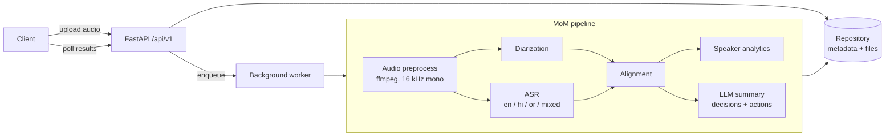

# Polymom

Voice-based **Minutes of Meeting** pipeline. Upload a meeting recording and get back:

- **Who spoke when** (multi-speaker diarization)
- **What was said** in English, Hindi, Odia and code-mixed speech (ASR)
- **Speaker analytics** such as talk time, turns and interruptions
- **An LLM summary** with key decisions and action items

Everything is exposed through a FastAPI service.

> Status: **scaffold only**. The health endpoint works; everything else is a documented stub. See the [roadmap](#roadmap).

## Architecture



Requests flow through the layers **routes → services / pipelines → repositories**. Routes get their dependencies (settings, repositories) injected through `app/api/deps.py`, so every layer can be swapped out in tests.

## Folder structure

| Path | Purpose |
| --- | --- |
| `app/main.py` | App factory (`create_app`), lifespan hooks, router registration |
| `app/api/deps.py` | Dependency-injection providers |
| `app/api/v1/` | Versioned routers: `health` (implemented), `meetings` (stubs) |
| `app/core/` | Settings (`pydantic-settings`), structured logging (`structlog`), exception hierarchy + handlers |
| `app/schemas/` | Pydantic request/response models |
| `app/models/` | Persistence entities |
| `app/repositories/` | Storage interface (`Protocol`) + in-memory implementation |
| `app/services/` | One package per pipeline stage: `audio`, `diarization`, `asr`, `alignment`, `analytics`, `summarization` |
| `app/pipelines/` | `MoMPipeline` orchestrator |
| `app/workers/` | Background job entry points |
| `app/utils/` | Framework-free helpers |
| `tests/` | `unit/` and `integration/` suites, shared fixtures in `conftest.py` |
| `docker/` | Multi-stage Dockerfile (non-root, ffmpeg) and compose file |
| `scripts/` | Dev/ops scripts |

## Setup

Prerequisites: Python 3.11+, [uv](https://docs.astral.sh/uv/), `make`, and `ffmpeg` (needed from Prompt 3 onward).

```bash
git clone https://github.com/PrayasPanda/polymom.git
cd polymom
cp .env.example .env       # fill in HF_TOKEN / LLM_API_KEY when needed
make dev                   # uv sync --all-groups + pre-commit install
```

### Configuration

| Variable | Default | Description |
| --- | --- | --- |
| `APP_ENV` | `development` | `development` / `staging` / `production` / `test`; non-development environments log JSON |
| `LOG_LEVEL` | `INFO` | Root log level |
| `HF_TOKEN` | – | Hugging Face token (for diarization models) |
| `LLM_PROVIDER` | `openai` | LLM backend for summaries |
| `LLM_API_KEY` | – | API key for the LLM provider |
| `STORAGE_DIR` | `./storage` | Where uploads and artefacts are stored |
| `MAX_UPLOAD_MB` | `200` | Upload size limit |
| `ALLOWED_EXTENSIONS` | `wav,mp3,m4a,flac,ogg,webm,mp4` | Comma-separated accepted file types |

## Running locally

```bash
make run
curl http://localhost:8000/api/v1/health
# {"status":"ok","app_name":"polymom","version":"0.1.0","env":"development"}
```

Interactive docs: <http://localhost:8000/docs>.

### Quality gates

```bash
make lint       # ruff check + format check
make typecheck  # mypy --strict on app/
make test       # pytest with coverage
make format     # auto-fix
```

## Running with Docker

```bash
make docker-build   # build polymom:latest
make docker-up      # docker compose up on port 8000 (reads .env if present)
```

The image uses a multi-stage build, runs as a non-root `app` user, installs `ffmpeg`, and defines a `HEALTHCHECK` against `/api/v1/health`.

## Roadmap

| # | Prompt | Scope |
| --- | --- | --- |
| 1 | **Project scaffold** ✅ | Layout, tooling, CI, Docker, health endpoint |
| 2 | Upload API | Multipart upload, size/extension validation, storage, meeting records |
| 3 | Audio preprocessing | ffmpeg decode, resample, normalise, VAD |
| 4 | Speaker diarization | pyannote integration (optional `diarization` extra) |
| 5 | Multilingual ASR | Whisper-based ASR with language ID for en/hi/or and code-mixed speech |
| 6 | Alignment | Word-to-speaker attribution, speaker turns |
| 7 | Speaker analytics | Talk time, turns, interruptions, WPM |
| 8 | LLM summarization | Provider-agnostic summary, decisions and action items with structured output |
| 9 | Pipeline orchestration | End-to-end `MoMPipeline`, progress tracking, error handling |
| 10 | Background workers & persistence | Job queue, durable DB, retries |
| 11 | Results API & exports | Transcript/summary endpoints, Markdown/PDF/JSON export |
| 12 | Hardening & deployment | Auth, rate limiting, observability, GPU image, release |

## License

[MIT](LICENSE)
