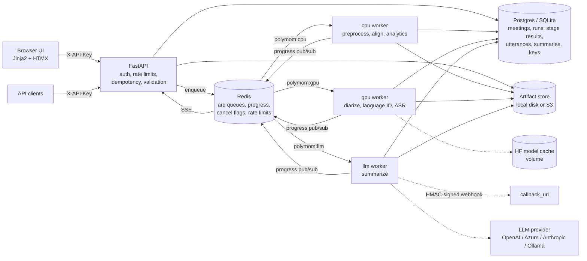
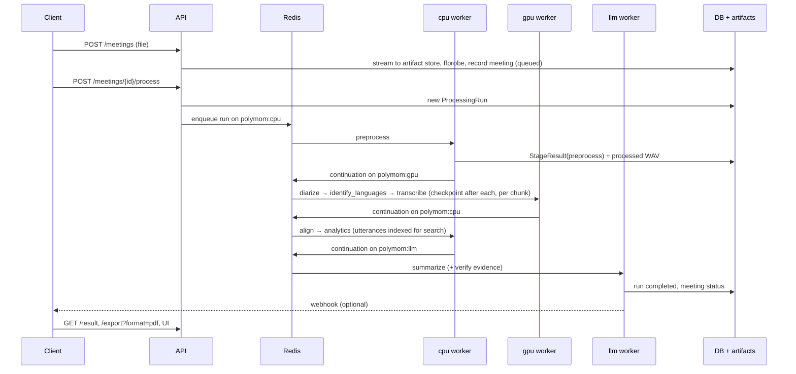

# Architecture

Polymom turns a meeting recording into speaker-attributed, multilingual minutes. The API
never loads a model: it validates, stores and enqueues. Workers, split by the resource they
need (cpu, gpu, llm), run an ordered pipeline of stages that checkpoint after every step.

## Components



| Component | Code | Responsibility |
| --- | --- | --- |
| HTTP API | `app/api/v1/routes/` | Upload, process, cancel, status/SSE, results, exports, search, speaker names |
| Web UI | `app/ui/` | Server-rendered pages; HTMX partials behind the same API-key dependency |
| Pipeline | `app/pipelines/mom_pipeline.py` | Stage registry, run lifecycle, checkpoints, hand-offs between queues, retries |
| Services | `app/services/<stage>/` | One package per stage: `audio`, `diarization`, `language`, `asr`, `alignment`, `analytics`, `summarization`, `export` |
| Backends | `*/base.py` + implementations | Interchangeable model integrations (real and mock) chosen by settings |
| Persistence | `app/repositories/`, `app/models/` | Repositories over SQLAlchemy, unit of work, artifact store, full-text search |
| Workers | `app/workers/` | arq worker per queue, progress reporter, webhooks, stuck-job reaper |
| Core | `app/core/` | Settings, structured logging, error hierarchy, metrics, tracing, middleware |

## Pipeline stages

| # | Stage | Queue | Input → output | Default implementation |
| --- | --- | --- | --- | --- |
| 1 | `preprocess` | cpu | upload → 16 kHz mono WAV, loudness/silence/clipping report | ffmpeg (loudnorm, high-pass, optional denoise/trim) |
| 2 | `diarize` | gpu | WAV → speaker turns `Person 1..N`, overlap regions | pyannote/speaker-diarization-3.1, chunked + embedding re-linking beyond 1 h |
| 3 | `identify_languages` | gpu | WAV + turns → language regions (en/hi/or), switch points | facebook/mms-lid-126 on turn windows, smoothed |
| 4 | `transcribe` | gpu | regions → timestamped segments in native script | Routed: faster-whisper large-v3 (en, hi), AI4Bharat IndicConformer (or) |
| 5 | `align` | cpu | words + turns → speaker-attributed utterances | Word-to-turn overlap assignment, sentence splitting, code-mix tags |
| 6 | `analytics` | cpu | utterances + turns → per-speaker and meeting statistics | Pure Python (talk time, turns, interruptions, WPM, Gini, timeline) |
| 7 | `summarize` (optional) | llm | utterances → MoM: summary, decisions, action items, open questions | Configured LLM, single pass or map-reduce, grounding verifier |

An optional stage that fails leaves the meeting `completed_with_errors`; a required stage
that fails leaves it `failed`, with the error code and a remediation message.

## Data flow of one run



Each worker publishes a progress snapshot after every stage and chunk. The API serves it
from Redis as a snapshot (`/status`) or as Server-Sent Events (`/status/stream`).

## Storage model

- **`meetings`**: upload metadata, owner key, status, latest error.
- **`processing_runs`**: one per processing request, with model versions and stage timings.
  The *default run* (latest successful) is what the read endpoints serve; older runs stay
  addressable at `/runs/{run_id}`.
- **`stage_results`**: status, duration, fingerprint and output per stage. Small outputs are
  inline JSON; outputs above `STAGE_OUTPUT_INLINE_MAX_BYTES` go to the artifact store.
- **`speakers`, `utterances`, `summaries`**: normalized rows for queries, display names and
  full-text search (SQLite FTS5, Postgres `tsvector`).
- **Artifact store**: `meetings/{id}/upload/original.*`, processed audio, chunk checkpoints,
  charts and rendered exports, under keys that are never served directly.

## Design patterns and why

| Pattern | Where | Why |
| --- | --- | --- |
| **Strategy** (pluggable backends) | `DiarizationBackend`, `ASRBackend` + `ASRRouter`, `LanguageIdentifier`, `LLMClient`, `ArtifactStore` | No single model covers English, Hindi and Odia well, and models change fast. Each concern has one interface with real and mock implementations, chosen by settings (`ASR_LANGUAGE_BACKENDS=en:whisper,hi:whisper,or:indic`). Swapping a model is a config change, and the whole system runs with mocks in CI and on laptops without GPUs. |
| **Pipeline of stages** | `PipelineStage` (`run`, `apply`, `name`, `queue`, `config_keys`, `optional`) | Each stage is small, testable in isolation, and declares the queue it needs and the settings that affect it. The orchestrator owns status, timing, retries, checkpoints and hand-offs once, instead of in every stage. Adding a stage means one class and one line in `build_pipeline`. |
| **Repository** | `MeetingRepository`, `ResultsRepository`, `SearchRepository`, `ApiKeyRepository` | Routes and services never write SQL. Tenant scoping (owner key) and cursor pagination live in one place, and SQLite (tests, dev) and Postgres (production) differ only behind the repository, for example FTS5 versus `tsvector` search. |
| **Unit of work** | `UnitOfWork` (one session, all repositories, `commit`/`rollback`) | A stage result, its normalized rows and the run's status change commit together or not at all. A crash can never leave a run that says "transcribed" without utterances, which is what makes checkpoints trustworthy for resume. |
| **Dependency injection** | `app/api/deps.py` (FastAPI `Depends`) | Every service, backend and store is built from settings in one place and overridden in tests (`create_app(settings)`). No module-level singletons except the model caches. |
| **Checkpoint + fingerprint** | `app/pipelines/checkpoints.py` | Resume after a crash, deploy or retry without redoing hours of GPU work. A fingerprint mismatch (another model or setting) reruns exactly the affected stages. |
| **Queue per resource** | arq queues `cpu`, `gpu`, `llm` | A GPU runs one job at a time while CPU and LLM work continues in parallel. Each pool scales on its own queue depth. |

## Cross-cutting concerns

- **Errors**: one `PolymomError` hierarchy with stable `code`, `remediation` and a
  `retryable` flag. The same envelope is used in HTTP responses and in stored run errors.
- **Logging**: structlog JSON with `request_id`, `meeting_id`, `run_id`, `stage` and `queue`
  bound as context and propagated into jobs.
- **Security**: API keys hashed at rest, tenant scoping in repositories, rate limits in
  Redis, SSRF-safe webhooks, sandboxed ffmpeg protocols, strict CSP (the UI has its own,
  still without inline scripts or styles). See [SECURITY.md](SECURITY.md).
- **Observability**: Prometheus metrics, OpenTelemetry spans, Langfuse for LLM calls,
  health and readiness probes. See [OPERATIONS.md](OPERATIONS.md#monitoring).

## Code map

```text
app/
  main.py                 app factory: middleware, routers, UI, static files, lifespan
  api/                    deps (DI), auth, idempotency, v1 routes
  ui/                     routes.py, templates/, static/ (htmx, app.js, app.css)
  core/                   config, logging, exceptions, metrics, tracing, rate limits
  pipelines/              MoMPipeline, stages, checkpoints
  services/               audio, diarization, language, asr, alignment, analytics,
                          summarization (prompts/*.j2), llm, export (docx, pdf, md)
  repositories/           repositories, unit of work, search, artifacts (local, s3)
  models/ schemas/        SQLAlchemy entities, Pydantic API models
  workers/                arq worker, queue, progress, webhooks, inline runner
scripts/                  API keys, cleanup, demo, evaluation (prepare, meetings, benchmark)
tests/                    unit/, integration/ (ASGI + testcontainers), e2e/ (compose stack)
docker/                   Dockerfile, compose (+ e2e overlay), Prometheus, Grafana
```
